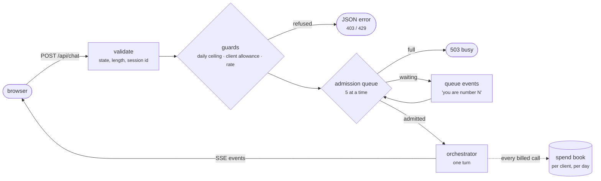
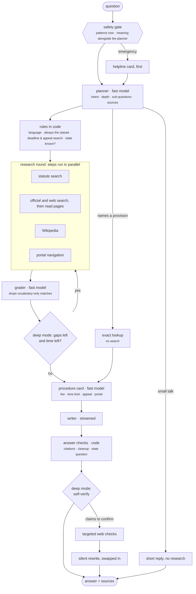
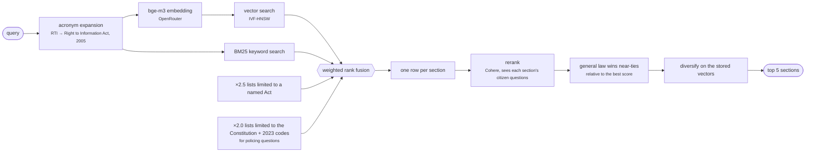
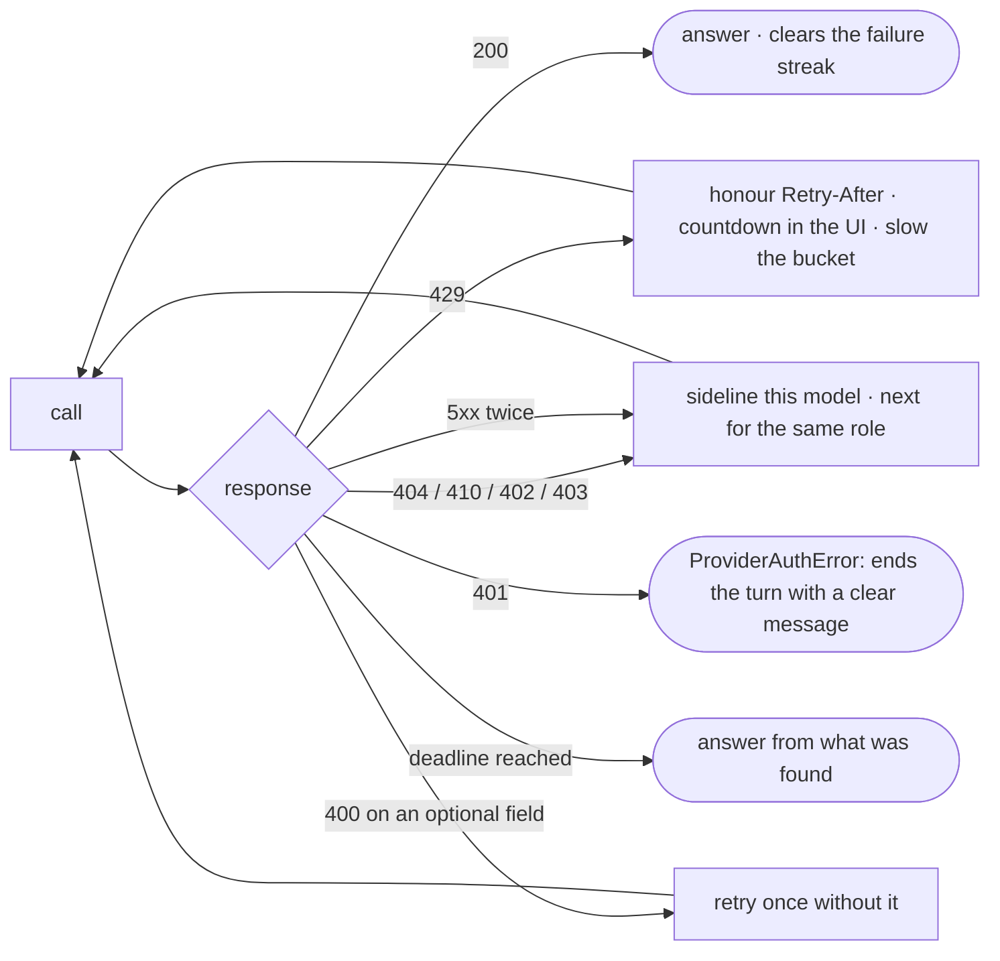

# Architecture

How one question becomes one cited answer, and why each part is there rather than something
simpler. For the numbers behind these decisions, see [EVALUATION.md](EVALUATION.md).

## Contents

1. [Design principles](#1-design-principles)
2. [A request, end to end](#2-a-request-end-to-end)
3. [The pipeline](#3-the-pipeline)
4. [The safety gate](#4-the-safety-gate)
5. [Statute retrieval](#5-statute-retrieval)
6. [Models and failure handling](#6-models-and-failure-handling)
7. [When something fails: degraded modes](#7-when-something-fails-degraded-modes)
8. [Jurisdiction](#8-jurisdiction)
9. [Writing and checking the answer](#9-writing-and-checking-the-answer)
10. [Conversation memory](#10-conversation-memory)
11. [Cost tracking and public-deployment limits](#11-cost-tracking-and-public-deployment-limits)
12. [Security](#12-security)
13. [Module map](#13-module-map)

---

## 1. Design principles

- **Code orchestrates; models advise.** A model emits a validated plan and Python executes it.
  A model that cannot call tools cannot hallucinate a tool call, and a web page cannot trigger
  one.
- **Rules a model follows only sometimes are enforced in code.** Always searching the statute,
  asking which state, mapping IPC sections to BNS, dropping unverifiable citations: each is a
  deterministic step, because each went wrong in a real answer when it was only a prompt rule.
- **Degrade, never fail silently.** Every stage has a fallback, and the reader is told when one
  was used. Only a configuration problem (no key, a rejected key) stops a turn.
- **Deadlines, not attempt counts.** Each turn has a wall-clock budget. When it runs out,
  research stops and the answer is written from what was found.
- **Measure, then decide.** Model routing, thresholds and ranking weights come from scripts in
  `scripts/` that anyone can re-run.

## 2. A request, end to end



- **Validation** (`server/models.py`): the selected state must be one of the known states and
  union territories, because it is written into the prompt.
- **Guards** (`server/quota.py`): checked before any money is spent. A client is identified by
  IP address, stored only as a salted hash.
- **Admission** (`server/admission.py`): a first-come queue with a length cap, a wait cap and a
  per-client share. A reader who closes the tab gives their place back.
- **The turn** (`orchestrator/`): runs as a background task feeding an event queue, so a
  rate-limit pause deep inside the model client can still put a countdown on screen.

## 3. The pipeline



| Depth | Research rounds | Pages read | Time budget | Extra steps |
|---|---:|---:|---:|---|
| quick | 1 | 0 | 25 s | a named provision skips search entirely |
| standard | 1 | up to 3 | 75 s | procedure card for how-to questions |
| deep | up to 4 | up to 10, 2 links deep | 240 s | query rewriting, gap analysis, self-verification |

The planner chooses the depth unless the reader forces one.

## 4. The safety gate

It runs first because someone writing *"he is hitting me right now"* needs 112 before anything
else, even when every model provider is down.

| Tier | How | Cost | Notes |
|---|---|---|---|
| 1 · patterns | literal phrasings, strong and weak | none, synchronous | strong ("hitting me", "I was raped") always fire; weak bare nouns ("suicide") only when the message is not a question about the law |
| 2 · meaning | cosine similarity to curated crisis exemplars (English, Hindi, Hinglish) | one embedding, run alongside the planner | suppressed for messages that read as questions *about* the law |

Tier 2 fails open: if embeddings are unavailable, tier 1 still applies. The gate's result is
settled before research begins, so the card always comes first.

## 5. Statute retrieval



Each non-obvious box answers an observed failure:

| Step | What went wrong without it |
|---|---|
| Act-filtered lists | "How do I file an RTI" ranked unrelated institute Acts above the RTI Act. |
| General-law boost | "Can the police arrest me" returned the Navy, Forest and Railway Property Acts, which grant *someone* a power of arrest in near-identical words. |
| Citizen questions for the reranker | RTI §7 opens with provisos before it says "thirty days", and scored below a section that merely mentions "five days". |
| Acronyms annotated, not replaced, for the reranker | Expanded text reads as broken English to a cross-encoder; a bare "RTI" let the Credit Information Companies Act outrank RTI §19. |
| MMR on stored vectors | Diversity was once computed on re-encoded text, a space that was never searched. |

**Abstention.** When the best section scores below the calibrated threshold, retrieval reports
that it has nothing on point. Thresholds belong to a ranking method (reranker model and document
format, or fused ranking), are calibrated by `scripts/calibrate.py`, and ship in
`knowyourrights/thresholds.json`, which a local calibration in `.runtime/` overrides.

**Exact lookup.** "What does Article 21 say" and "Section 420 IPC" are fetched directly.
Repealed-code sections are translated through a verified map (38 entries checked against the
corpus headings); an old number with no verified mapping is never guessed.

## 6. Models and failure handling

| Role | Calls per question | Models, in order |
|---|---:|---|
| fast: plan, grade, gaps, procedure, fact-check, summary | 2–6 | Gemini 2.5 Flash-Lite → Mercury 2.5 → Nemotron Nano (OpenRouter) → Nemotron on NVIDIA NIM |
| writer: the answer | 1–2 | Qwen 3.7 Flash → Gemini 2.5 Flash-Lite → Nemotron Super 120B (free) → NVIDIA NIM |
| embeddings | 1–3 | `baai/bge-m3` (the corpus's own model) |
| reranking | 1–3 | `cohere/rerank-v3.5` |

The order is measured by `scripts/race_models.py` on the real prompts. Paid models lead the fast
role because it runs several times per question: a free model there would take ~30 s a stage and
spend the shared free allowance. The free 120B writer was fastest to its first token but broke 12
of 22 streams in one session, so a reliable paid model leads.



A model is sidelined for the process on one failure and recorded as unavailable only after three
failures within an hour, because providers return 410 transiently under load. Fallbacks are
looked up per role: a model that serves two roles falls back within the role that failed.

## 7. When something fails: degraded modes

Every stage has a defined fallback. Readers are told when one ran.

| What fails | What happens | What the reader sees |
|---|---|---|
| Embedding API | keyword (BM25) search only; the safety gate keeps its pattern tier | notice: search is keyword-only and may miss sections |
| Reranking API | ordered by fused scores, under that mode's own threshold | notice: sources ordered by a simpler method |
| Planner | a default plan: statute search on the question | notice: researched without a tailored plan |
| Grader | every source kept, marked unvetted | notice: some sources may be loosely related |
| Gap analysis, procedure card, query rewriting, fact-check | the stage is skipped | nothing (the answer is complete without it) |
| Writer | the provisions found, quoted with their citations | notice, and the answer is the raw provisions |
| Writer cut off mid-answer | what arrived is kept | notice: the answer may be incomplete |
| Time budget | research stops; the answer is written from what was found | notice |
| API key rejected | the turn stops | error: the operator needs to fix the key |
| No provider configured | every question is refused | error; `/api/health` reports `unavailable` |

## 8. Jurisdiction

The corpus's `jurisdiction` column says `central` for every row, including state Acts that leaked
in, so jurisdiction is read from the Act's title:

| Label | Meaning | Example |
|---|---|---|
| CONSTITUTION | applies nationwide | Article 21 |
| CENTRAL | applies across India | Right to Information Act, 2005 |
| TERRITORY | passed by Parliament for one Union Territory; applies only there | Delhi Rent Control Act, 1958 |
| STATE | a state legislature's law; applies only in that state | Maharashtra Rent Control Act, 1999 |

The writer is told that the law of **where the matter is** governs, not where the reader lives.
When the answer depends on a state nobody named, a question asking which state is appended. A
question that names a place (a state, a union territory or a major city) is not asked.
Source cards also carry corrections the corpus cannot know: the 2019 change to Jammu & Kashmir,
references to the repealed codes, and an Act that was passed but never brought into force.

## 9. Writing and checking the answer

The writer receives only the packed sources, each labelled with its jurisdiction and marked as
untrusted data if it came from the web. The packer reserves a place for each kind of source so a
long web page cannot crowd out the statute, and it trims a copy rather than the shared original.

After writing, code checks and cleans the text (`agents/answer_text.py`):

- every `[S1]` must resolve to a supplied source; unresolvable markers are removed;
- invented citation shapes (`[S1(a)]`, `[S1, S2]`) are normalised so they can be linked;
- page titles pasted as link text are shortened; prompt block names cited as sources are removed;
- "the sources do not state…" lines are dropped, with any heading they leave empty;
- the which-state question is added once, in the reader's language, if needed.

In deep mode a fact-checker names claims worth confirming (fees, deadlines); two targeted web
searches check them, and the answer is rewritten silently and swapped in whole, so the reader
never watches it restart.

## 10. Conversation memory

- **History** is built newest-first under a token budget, with each past answer capped, so a
  follow-up always sees the exchange it refers to. The current question is not repeated in its
  own history. Older turns fold into a rolling summary written in the background.
- **Sources** vetted earlier are recalled for a follow-up when they share enough of its words,
  and go through the grader again. The pool is bounded (40 sources per conversation).
- **Sessions** are held in memory: at most 200, dropped after six idle hours.

## 11. Cost tracking and public-deployment limits

Every billed call (chat, embedding, reranking) charges the turn that made it through a context
variable, so concurrent turns each know their own exact cost and each client's spend is
attributed correctly. That feeds:

| Limit | Default | Behaviour |
|---|---|---|
| Answers at once | 5 | later questions queue and see their place in line |
| Queue | 20 waiting, 180 s wait | beyond either, the request is turned away |
| Per client | 2 in progress or waiting, 10 per minute | 429 with `Retry-After` |
| Per-client allowance | $1 | a popup says the free allowance is used up; the input is disabled |
| Service per day | $5 | everyone is told to come back tomorrow |

A question already running is allowed to finish, so a client can end slightly over its
allowance by at most one answer's cost. The spend book survives restarts.

## 12. Security

| Risk | Measure |
|---|---|
| Prompt injection from web pages | crawled text is sanitised, injection phrases removed and flagged, and delivered as labelled data; the model cannot call tools |
| Server-side request forgery | the crawler fetches only public http(s) addresses: every resolved IP is checked, and each page again by its final URL after redirects |
| Injection through request fields | the state must be a known state; all fields are length-bounded; session ids are restricted to safe characters |
| Cross-site scripting | the UI escapes everything before rendering markdown; links must be http(s); a Content-Security-Policy restricts scripts to the app's own |
| Information leaks | errors show a reference, not internals; `/api/status` needs a token or a local request |
| Abuse and cost | admission queue, per-client rate limit and allowance, daily ceiling |
| Secrets | read from the environment only; `.env` and key files are gitignored |

## 13. Module map

```text
knowyourrights/
├── config.py                every setting; environment overrides
├── events.py                the typed events streamed to the browser
├── evidence.py              the Evidence type: source, trust tier, jurisdiction, corrections
├── legal_terms.py           acronyms, repealed codes, section map, language detection, places
├── safety.py                the two-tier safety gate
├── thresholds.json          shipped retrieval calibrations
├── server/
│   ├── api.py               routes, lifespan, security headers, maintenance loop
│   ├── models.py            validated request bodies
│   ├── admission.py         the admission queue
│   ├── quota.py             spend book, per-client rate limit, guard
│   └── sessions.py          in-memory conversations
├── orchestrator/
│   ├── core.py              the turn: plan, gather, write, verify, commit; failure reporting
│   ├── research.py          research rounds, grading, tools, page reading, procedure card
│   ├── writer.py            prompt, stream, fallbacks, finalising
│   ├── verify.py            deep-mode self-check
│   ├── digest.py            the no-model fallback answer
│   └── turn.py              turn state and budget; degraded-stage helper
├── agents/
│   ├── planning.py          the planner and the rules applied to its plan
│   ├── grading.py           the relevance grader and its rescue path
│   ├── stages.py            query writer, gap analyst, procedure extractor, fact-checker, summary
│   ├── answer_text.py       deterministic answer checks and cleanup
│   ├── prompts.py           every system prompt
│   └── schemas.py           validated stage outputs
├── retrieval/
│   ├── search.py            the search pipeline and its degradation ladder
│   ├── ranking.py           fusion, MMR, what the reranker reads
│   ├── store.py             LanceDB access and exact lookup
│   ├── embedder.py          embeddings over the API, cached
│   └── reranker.py          reranking over the API; thresholds
├── llm/
│   ├── client.py            chat, structured chat, streaming
│   ├── failures.py          what each failed response means
│   ├── streaming.py         reading a chat stream
│   ├── registry.py          model routing and sidelining
│   ├── limiter.py           per-model rate limiting (AIMD)
│   ├── retrieval_api.py     embedding and reranking endpoints
│   ├── ledger.py            usage log and the free tier's daily allowance
│   ├── spend.py             per-turn spend meters
│   └── errors.py            the error types callers act on
├── tools/
│   ├── legal_db.py          statute search, exact lookup, caveats
│   ├── web.py               web search
│   ├── crawl.py             reading pages (HTTP first, browser when needed)
│   ├── navigate.py          walking a portal towards a procedure
│   ├── pages.py             the page model, sanitising, evidence conversion
│   ├── url_safety.py        which URLs may be fetched
│   └── wikipedia.py         background summaries
├── context/                 token budgets, conversation memory, page reduction, packing
├── runtime/                 the on-disk cache, console helpers
└── web/                     index.html, app.js, styles.css
```
