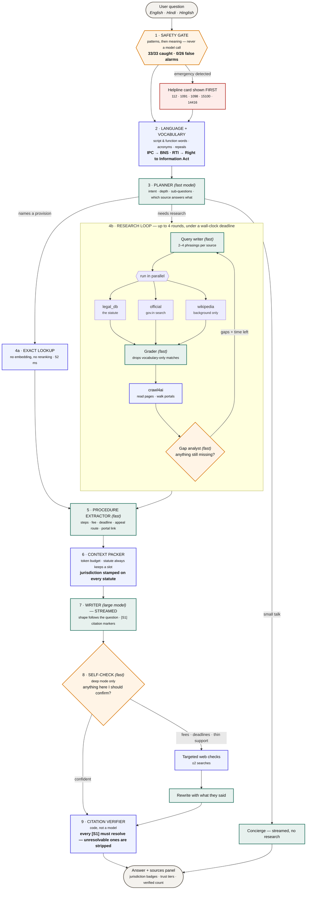
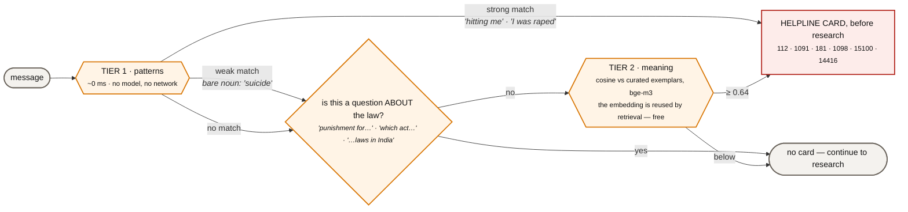
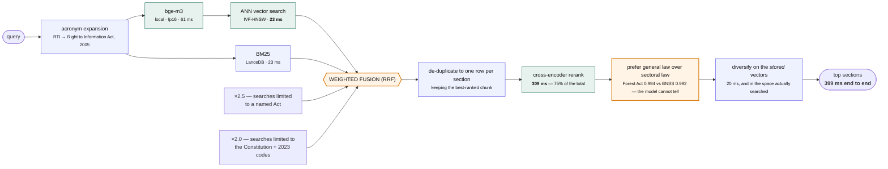
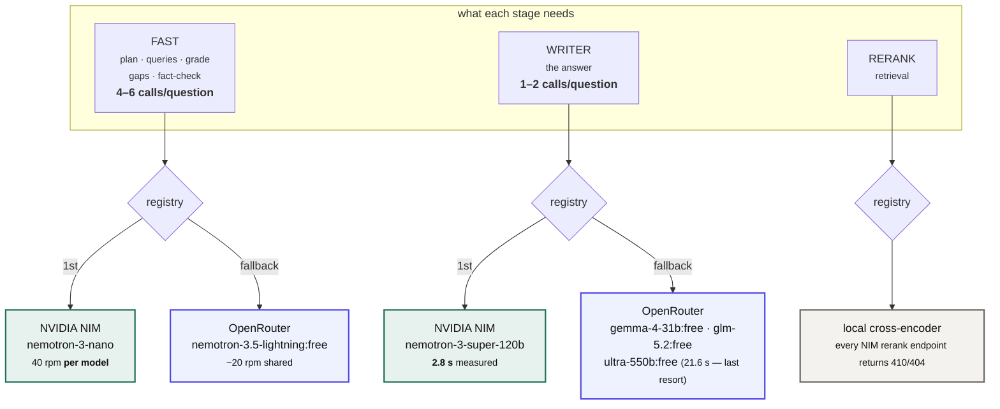
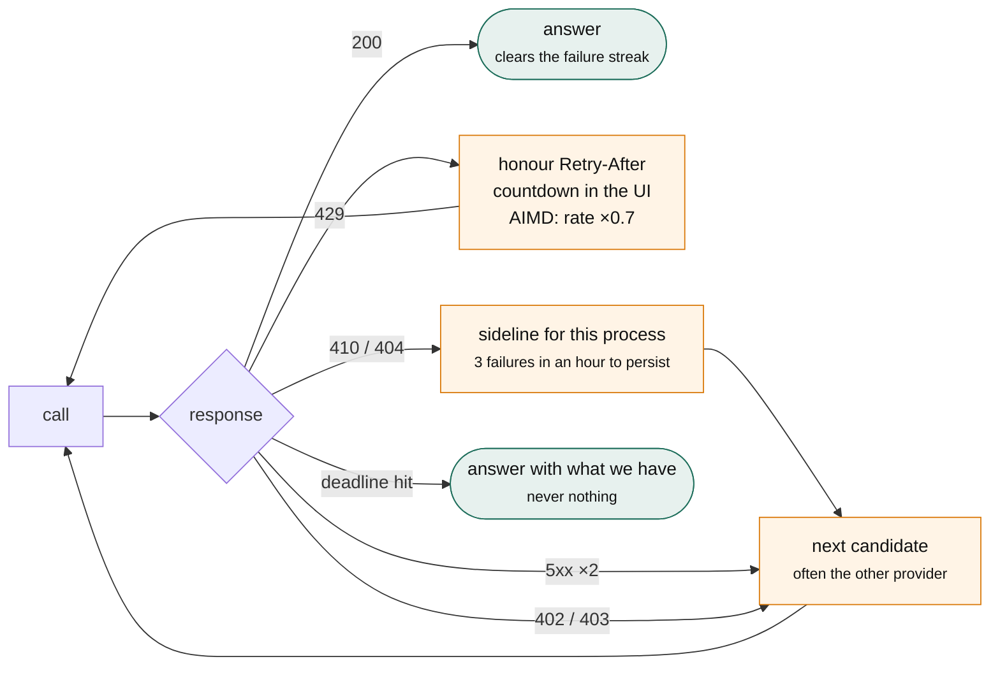
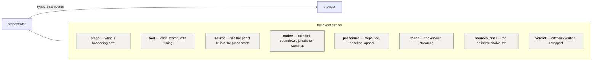
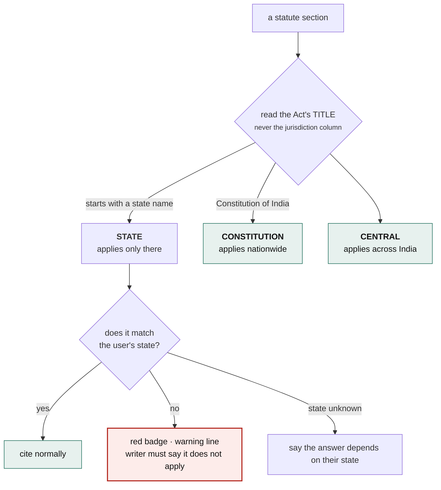

# How KnowYourRightsAI works

One question in, one cited answer out. This is everything in between — what runs, when, and
why it is there rather than something simpler.

---

## The whole pipeline

**Green = a model call. Blue = plain Python. Amber = a decision point. Red = safety.**

The shape of that diagram is the main design decision: **the blue boxes are in charge.** The
model never chooses to call a tool — it emits a validated plan, and Python executes it. A model
that cannot call tools cannot hallucinate a tool call, and a web page full of hostile
instructions cannot trigger one either.

---

## The safety gate — the one thing that runs before everything

It is first in the pipeline on purpose. Someone typing *"he is hitting me right now"* needs 112
before anything else happens, and that has to hold when every model provider is rate-limited,
retired, or down. So the gate never makes a model call.

**Why two tiers.** Patterns are instant and exact, and they cannot generalise. *"my partner
keeps hurting me and I am scared to go home"* matches nothing literal — and it is exactly what
someone types. So a second tier compares the message against curated exemplars of each crisis,
written the way frightened people write, in English, Hindi and Hinglish. It uses the embedder
already loaded for retrieval, and retrieval embeds the same string moments later and reads it
from cache, so the tier costs one embedding per turn rather than one per tier.

**Why strong and weak patterns.** Bare topic nouns are the vocabulary of the crime *and* of
every legal question about it. Matching them naively produced helpline cards on *"is suicide a
crime in India"* and *"child labour laws in India"*. Strong phrasings carry a subject or object
and fire unconditionally; weak ones are suppressed when the message reads as a question.

| | Disclosures caught | False alarms |
|---|---:|---:|
| Patterns only | 17 / 33 | 3 / 26 |
| **Both tiers** | **33 / 33** | **0 / 26** |

Scored on 33 labelled disclosures — literal and paraphrased, three languages — against 26 legal
questions deliberately chosen to be *about the same crimes in the same words*. Both sets live in
[`knowyourrights/safety_eval.py`](knowyourrights/safety_eval.py);
`python scripts/calibrate_safety.py` sweeps the threshold and prints the whole curve, weighting
a miss four times a false alarm.

**It fails open, never closed.** A broken embedder, or the `lite` profile which loads none,
degrades to tier 1 rather than to nothing.

---

## Retrieval, in detail

The statute search is where most of the engineering went.

Four of those boxes exist because of a specific observed failure:

| Box | What went wrong without it |
|---|---|
| **ANN vector search** | The corpus shipped with no vector index. Every query scanned 38,890 × 1024 floats — **159 MB**, 304 ms. |
| **Act-filtered lists ×2.5** | "How do I file an RTI" returned three unrelated *institute* Acts above the RTI Act. |
| **Prefer general law** | "Can the police arrest me" returned the **Navy Act, Forest Act and Railway Property Act** — all of which grant *someone* a power of arrest, in near-identical words. |
| **MMR on stored vectors** | Diversity was computed by re-encoding `chunk_text`, but the index holds vectors of `embed_text`. It was measuring in a space that was never searched. |

---

## Where the models come from

Two providers, because one turned out to be an unreliable dependency.

**The order is measured, not assumed.** NVIDIA leads the fast role because its limit is 40/min
*per model* while OpenRouter shares ~20/min across all free models — and the fast role fires
4–6 times per question, so OpenRouter 429s almost immediately. NVIDIA also leads the writer
role on latency: 2.8 s against 4.1 s for the same model on OpenRouter.

And bigger is not better. `nemotron-3-ultra-550b` is the largest free model available anywhere
in this stack, and it took **21.6 seconds** for a two-sentence answer. It is kept last, as an
availability backstop.

**The embedder cannot move.** The corpus is embedded with `bge-m3`, so a different model means
re-embedding all 38,890 chunks. It runs locally, permanently, on whatever machine this is on.

### When a provider fails

A single 410 no longer retires a model. NVIDIA returns them transiently under load — observed
live, a model 410'd on one call and answered normally on the next — and the earlier behaviour
of writing that verdict to disk meant one blip silently moved the whole app onto its fallback.

---

## What the user actually sees

Typed events rather than a bare token stream, because a deep research turn runs for up to a
minute and a blank screen is indistinguishable from a crash. `sources_final` exists because the
packer re-assigns ids at the end — without it a citation chip could point at nothing.

---

## Jurisdiction — the thing it must not get wrong

Telling someone in Kerala that a Maharashtra rent law governs them is worse than telling them
nothing. So jurisdiction is never inferred:

The corpus's own `jurisdiction` column says `central` for **every** row — including the 53
state Acts that leaked in from the source dataset. The Act title is the only trustworthy
signal, which is why it is the one that is used.

---

## What runs where

The same pipeline, sized to the machine. Only the two local models move; everything else is
identical, which is why **accuracy is a property of the system and latency is a property of the
box**.

| Profile | Embedder | Reranker | Recall@5 | Off-topic caught | Retrieval | Picked when |
|---|---|---|---:|---:|---:|---|
| `quality` | bge-m3 fp16 GPU | bge-reranker-v2-m3 | 100% | 11/11 | ~0.4 s | VRAM ≥ 3600 MiB |
| `balanced` | bge-m3 fp16 GPU | bge-reranker-base | 100% | 11/11 | ~0.4 s | VRAM ≥ 2900 MiB |
| **`cpu`** ← deployed | bge-m3 fp32 CPU | bge-reranker-base, pool 8 | **95.2%** | **10/11** | **6.6 s** | no usable CUDA |
| `cpu_lean` | bge-m3 fp32 CPU | none — fused RRF | 93% | 5/11 | 0.09 s | CPU box too slow to demo |
| `lite` | none | none — BM25 only | 90.5% | 5/11 | 0.06 s | under 2 GB RAM |

Two things this table is really saying:

**The cross-encoder's job is refusal, not ranking.** Removing it costs 7 points of Recall@5,
which is survivable, and takes off-topic rejection from 10/11 to 5/11, which is not. Without it
the answerable and off-topic score populations overlap, so no threshold separates them. The
deployed profile therefore keeps the model and shrinks its pool to 8 documents instead of
dropping it — 8 is enough to preserve the refusal and a third of the cost.

**Thresholds belong to a configuration, not a model.** They are keyed by backend, model,
quantisation and input length, because each of those moves the score distribution while leaving
the model's name unchanged. Reusing a calibration across them is silent and it breaks
abstention: measured, int8 scored against float32's threshold let off-topic questions through
6 times in 11 instead of 1.

### Measured on the deployment target

`m7i-flex.large`, 2 vCPU (**1 physical core**), 8 GB, Ubuntu 24.04, no GPU — against the
development laptop with an RTX 3050:

| | Laptop (GPU) | EC2 (CPU) | |
|---|---:|---:|---|
| Recall@5 | 95.2% | **95.2%** | identical |
| MRR | 0.861 | 0.854 | float32 vs fp16 flips near-ties |
| Off-topic wrongly answered | 0/8 | **0/8** | |
| Exact lookup | 4/4 | **4/4** | |
| Cold start | 56.7 s | **16.0 s** | no CUDA init |
| Dense search | 33 ms | **12 ms** | EC2 is faster |
| BM25 | 32 ms | **8 ms** | EC2 is faster |
| Cross-encoder | 309 ms* | **6,625 ms** | one core, no GPU |

\* on a GPU at full clock. Regenerate any of this on your own machine with
`python scripts/benchmark.py --all` then `python scripts/deploy_report.py`.

The searches feeding the reranker are *faster* on the small cloud box than on the laptop. All
of the difference is the cross-encoder, and all of that is having one physical core.

---

## Cost and limits at a glance

| | |
|---|---|
| Embedder | local, always — corpus-locked to bge-m3 |
| LLM calls per question | 4 (quick) · 8 (standard) · 20 (deep), as ceilings |
| NVIDIA free tier | ~1,000 credits, 40 rpm **per model** |
| OpenRouter free tier | 1,000 requests/day, ~20 rpm **shared across all free models** |
| Corpus | 38,890 chunks · 35,170 sections · 1,020 Acts · ~300 MB |
| Hosting | $0.0958/hour running, $1.60/month stopped |

Both free tiers are tracked client-side. OpenRouter's daily count survives restarts, so
bouncing the server cannot quietly blow the allowance, and a spent provider is skipped rather
than tried and refused.
