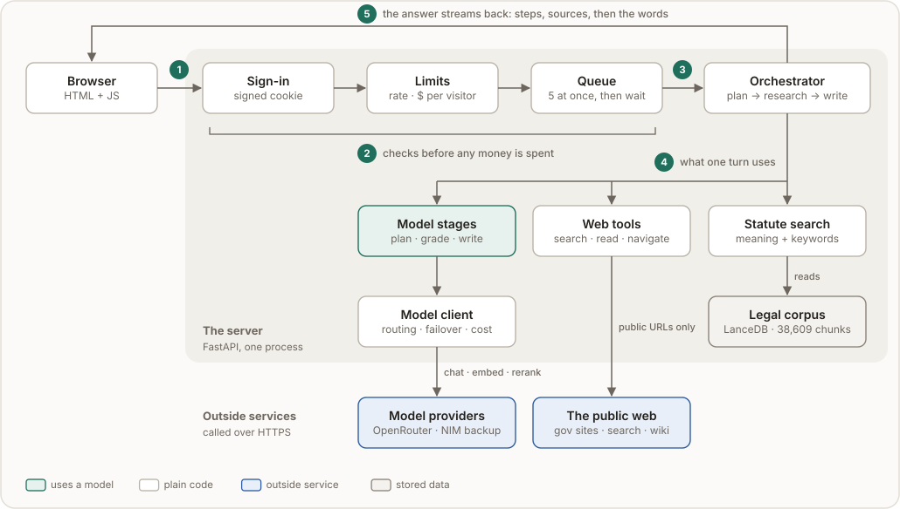
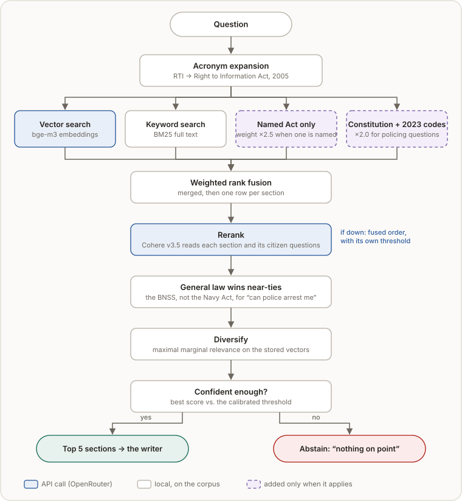

# Architecture

How a question becomes a cited answer, and why each part exists. The numbers behind these
choices are in [EVALUATION.md](EVALUATION.md).

**Contents:** [Principles](#principles) · [The system](#the-system) ·
[Answering a question](#answering-a-question) · [Statute search](#statute-search) ·
[Models and failover](#models-and-failover) · [When something fails](#when-something-fails) ·
[Jurisdiction](#jurisdiction) · [Checking the answer](#checking-the-answer) ·
[Memory](#memory) · [Security](#security) · [Code map](#code-map)

## Principles

| Principle | In practice |
|---|---|
| **Models advise; code decides** | A model writes a validated plan and Python runs it. A model that cannot call tools cannot invent a tool call, and a web page cannot trigger one. |
| **Rules that matter are code, not prompts** | Always search the statute, map IPC to BNS, ask which state, drop unverifiable citations: each failed in a real answer while it was only a prompt instruction. |
| **Degrade loudly, never silently** | Every stage has a fallback, and the reader is told when one ran. Only a missing or rejected API key stops a turn. |
| **Deadlines, not retry counts** | Each turn has a time budget. When it runs out, research stops and the answer is written from what was found. |
| **Measure, then decide** | Model order, thresholds and ranking weights come from scripts in `scripts/` that anyone can re-run. |

## The system

<p align="center"></p>

One process holds everything in memory (sessions, queue, limits), so it runs as a single worker.
A request passes four gates before any money is spent:

| Gate | What it enforces | Default |
|---|---|---|
| Sign-in | a signed, HttpOnly cookie; 10 wrong passwords lock an address for 15 min | off until `KYR_LOGIN_USERS` is set |
| Validate | every field bounded; the state must be a known state (it is written into the prompt) | — |
| Guards | questions per minute and in flight, per visitor; $ per visitor; $ per day for the site. An operator's reset code restores a spent allowance. | 10/min, 2 · $1 · $5 |
| Admission queue | answers at once; later ones wait and see their place in line | 5 at once, 20 waiting, 180 s max |

Visitors are identified by IP address, stored only as a salted hash. Every billed call charges
the turn that made it, so concurrent answers each know their exact cost; the spend book
survives restarts. A running answer may finish, so a visitor can overshoot by one answer at most.

## Answering a question

<p align="center"></p>

Steps 2, 4 and 5 are model calls; 1, 3 and 6 are plain code, and so is every decision about what runs next. The planner picks a depth unless the reader forces one:

| Depth | Research rounds | Pages read | Time budget | Also |
|---|---:|---:|---:|---|
| Quick | 1 | 0 | 25 s | a named provision is answered from its own text, no search |
| Standard | 1 | up to 3 | 75 s | procedure card for how-to questions |
| Deep | up to 4 | up to 10, 2 links deep | 240 s | gap analysis between rounds, self-verification |

**The safety gate** runs first, because someone writing *"he is hitting me right now"* needs 112
before anything else, even if every model provider is down:

| Tier | How | Notes |
|---|---|---|
| Patterns | literal phrasings; no model, no network | strong phrases always fire; bare words ("suicide") only when the message is not a question about the law |
| Meaning | similarity to curated crisis examples in English, Hindi and Hinglish | one embedding, run alongside the planner; skipped for questions *about* the law; if embeddings fail, patterns still apply |

## Statute search

<p align="center"></p>

Each non-obvious step fixes a failure that was observed:

| Step | Without it |
|---|---|
| Lists limited to a named Act (×2.5) | "How do I file an RTI" ranked unrelated institute Acts above the RTI Act. |
| General codes weighted up (×2.0) for policing questions | "Can the police arrest me" returned the Navy, Forest and Railway Acts, which give *someone* a power of arrest in near-identical words. |
| Reranker reads each section's citizen questions | RTI §7 opens with provisos before "thirty days" and ranked below a section that merely mentions "five days". |
| General law wins near-ties (relative to the best score) | A flat boost tuned for one reranker lifted an irrelevant Article above the right Act. |
| Diversify on the stored vectors | Diversity was once computed on re-encoded text, a space that was never searched. |

**Abstention.** Below a calibrated score, search reports that it has nothing on point instead of
returning its best guess. Thresholds are per ranking method, set by `scripts/calibrate.py` and
shipped in `knowyourrights/thresholds.json`.

**Exact lookup.** "Article 21" or "Section 420 IPC" is fetched directly. Repealed-code sections
are translated through a verified map (39 entries, each checked against the corpus); a section
with no verified mapping is never guessed.

## Models and failover

Everything runs through APIs; nothing is loaded locally.

| Role | Calls per question | Models, in order |
|---|---:|---|
| Fast: plan, grade, gaps, procedure, fact-check, summary | 2–6 | Gemini 2.5 Flash-Lite → Mercury 2.5 → Nemotron Nano → Nemotron on NVIDIA NIM |
| Writer: the answer | 1–2 | Qwen 3.7 Flash → Gemini 2.5 Flash-Lite → Nemotron Super 120B (free) → NVIDIA NIM |
| Embeddings | 1–3 | `baai/bge-m3`, the model the corpus was built with |
| Reranking | 1–3 | `cohere/rerank-v3.5` |

The order comes from `scripts/race_models.py` on the real prompts. Paid models lead because the
fast role runs several times per question; the free 120B writer was fastest to its first word
but broke 12 of 22 streams in one session.

| A call returns | The client |
|---|---|
| 429 rate limit | waits as told, shows a countdown, slows that model's request rate |
| 404, 410, 402, 403, or 5xx twice | sets the model aside and tries the next one for the same role |
| 400 on an optional field | retries once without it |
| 401 | stops the turn: the key is wrong, and retrying will not fix it |
| Time budget reached | stops researching; the answer is written from what was found |

A model is set aside for the process on one failure but recorded as unavailable only after three
within an hour, because providers return 410 briefly under load.

## When something fails

| What fails | What happens | What the reader sees |
|---|---|---|
| Embeddings | keyword search only; the safety gate keeps its pattern tier | notice: search may miss sections |
| Reranker | fused order, with that mode's own threshold | notice: sources ordered more simply |
| Planner | a default plan: search the statute for the question | notice |
| Grader | all sources kept, marked unvetted | notice |
| Gaps, procedure card, fact-check | that step is skipped | nothing: the answer stands without it |
| Writer | the provisions found are shown with their citations | notice |
| Writer cut off | what arrived is kept | notice: may be incomplete |
| API key rejected, or no provider | the turn stops; `/api/health` reports `unavailable` | a clear error |

## Jurisdiction

The corpus labels every row "central", including state Acts that slipped in, so jurisdiction is
read from the Act's title:

| Label | Applies | Example |
|---|---|---|
| Constitution · Central | across India | Article 21 · RTI Act, 2005 |
| Territory | one Union Territory only (passed by Parliament) | Delhi Rent Control Act, 1958 |
| State | one state only | Maharashtra Rent Control Act, 1999 |

The writer is told that the law of **where the matter is** governs, not where the reader lives.
If the answer depends on a state nobody named, it asks which one, once, in the reader's language.

## Checking the answer

The writer sees only the packed sources, each labelled with its jurisdiction; web text is marked
as untrusted data. The packer reserves room for each kind of source, so a long web page cannot
crowd out the statute. After writing, code (`agents/answer_text.py`):

- removes any `[S1]` that does not match a supplied source, and normalises invented shapes like
  `[S1, S2]`;
- drops "the sources do not say…" filler and any heading it leaves empty;
- adds the which-state question when it is needed.

In deep mode a fact-checker picks claims worth confirming (fees, deadlines), two targeted web
searches check them, and a corrected answer replaces the draft in one piece.

## Memory

| | |
|---|---|
| History | newest first under a token budget, each past answer capped; older turns fold into a rolling summary written in the background |
| Sources | sources vetted earlier are recalled for a follow-up that shares enough of its words, and graded again; up to 40 per conversation |
| Sessions | in memory: up to 200, dropped after 6 idle hours |

## Security

| Risk | Measure |
|---|---|
| Strangers spending the budget | optional sign-in; per-visitor allowance and rate limit; daily ceiling; queue. The reset code is compared in constant time and, like passwords, locks an address out after 10 wrong tries. |
| Prompt injection from web pages | page text is sanitised, injection phrases removed, and passed as labelled data; models cannot call tools |
| Server-side request forgery | only public http(s) addresses are fetched; every resolved IP is checked, again after redirects |
| Cross-site scripting | the UI escapes everything before rendering; links must be http(s); a Content-Security-Policy allows only the app's own scripts |
| Forged visitor addresses | proxy headers are trusted only when `KYR_TRUST_PROXY_HEADERS` is set |
| Leaks | errors show a reference, not internals; `/api/status` needs the admin token |
| Secrets | environment only; `.env` and key files are gitignored |

## Code map

```text
knowyourrights/
├── config.py             every setting, overridable from the environment
├── events.py             the typed events streamed to the browser
├── evidence.py           a source: trust tier, jurisdiction, corrections
├── legal_terms.py        acronyms, repealed-code map, language, places
├── safety.py             the two-tier safety gate
├── server/               api (routes), auth (sign-in), models (validation),
│                         admission (queue), quota (limits, spend book), sessions
├── orchestrator/         core (the turn), turn (state, budget), research, writer, verify,
│                         digest (the no-model fallback)
├── agents/               planning, grading, stages, answer_text, prompts, schemas
├── retrieval/            search (pipeline), ranking, store (LanceDB), embedder, reranker
├── llm/                  client, registry (routing), failures, limiter, streaming, spend,
│                         ledger (usage log), retrieval_api (embeddings, reranking), errors
├── tools/                legal_db, web, crawl, navigate, pages, url_safety, wikipedia
├── context/              token budgets, memory, page reduction, packing
├── runtime/              on-disk cache, console helpers
└── web/                  index.html, app.js, styles.css
```
