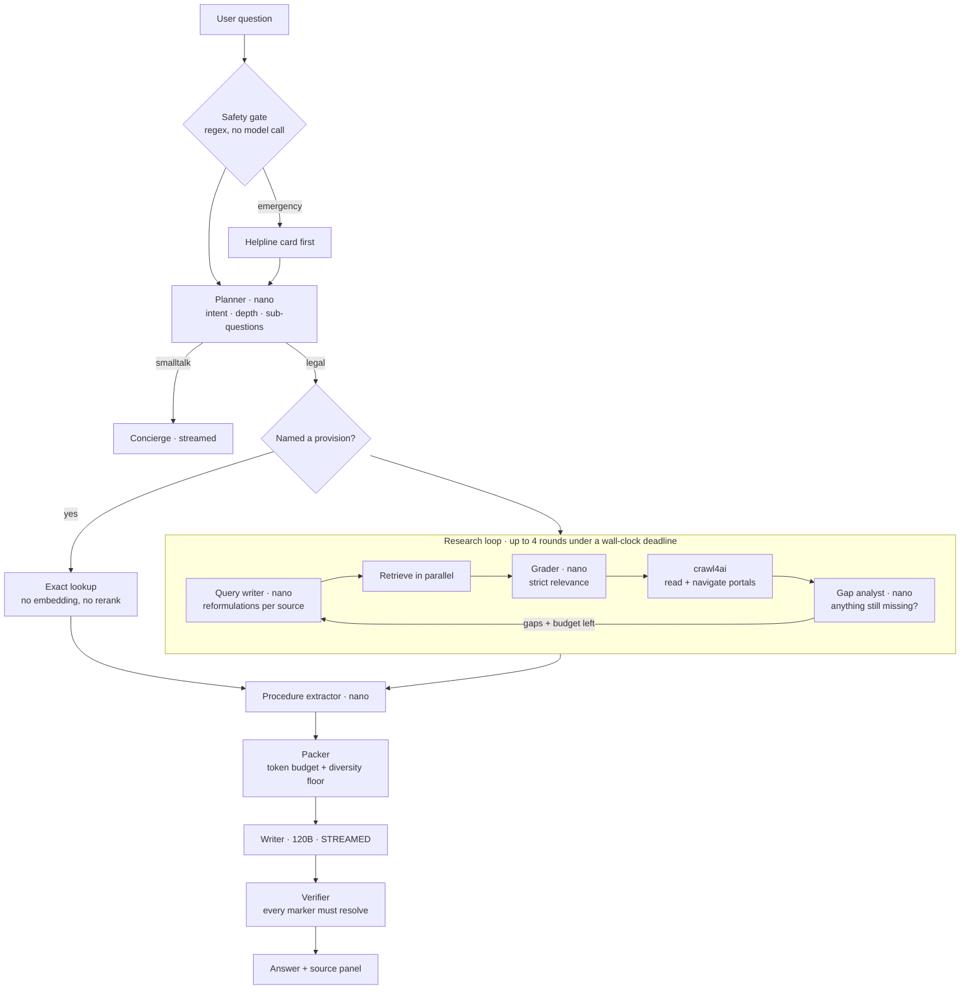
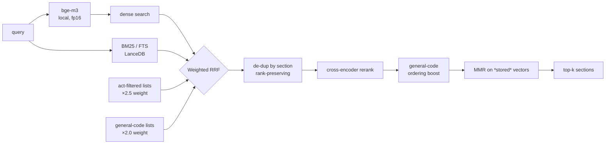

<div align="center">

# ⚖️ KnowYourRightsAI

**A legal research agent over Indian central law.**
Ask in English, Hindi or Hinglish — it searches the statute, reads official government sites
when the answer depends on current procedure, and replies in plain language **with the section
it relied on.**

[](../../actions/workflows/tests.yml)


*General legal information, not legal advice.*

</div>

---

## The problem this solves

Ask most assistants "can the police arrest me without a warrant?" and you get fluent,
confident text with no way to check it — and often a citation to the **Code of Criminal
Procedure, 1973**, which was repealed on 1 July 2024.

This system answers the same question with five sections of the *Bharatiya Nagarik Suraksha
Sanhita, 2023*, each one clickable, each one verified to exist before it reaches you.

```
You:  What are my rights if the police arrest me without a warrant?

  ▸ Understanding your question          legal_question · standard
  ▸ Searching Indian law                 5 found · 1.7s
  ▸ Checking which sources are relevant  kept 5 of 7
  ▸ Writing the answer

You must be told the full grounds of your arrest immediately [S1]. You must be produced
before a magistrate without unnecessary delay [S2], and cannot be held more than 24 hours
without authorisation [S3]. If the offence is bailable, you must be told you are entitled
to bail and may arrange sureties [S1].

  ✓ 5 citations verified · 0 unresolvable
```

---

## What makes it different

| | |
|---|---|
| **Citations are verified, not promised** | Every `[S1]` marker is checked against the evidence actually supplied. Unresolvable markers are stripped from the answer and reported — the model cannot invent a section number and have it survive. |
| **It knows what it does not know** | Calibrated abstention. **0 of 8** off-topic questions get an answer. State-law hits are labelled. Statutes absent from the corpus (PMLA, DPDP) are named as gaps rather than substituted with something adjacent. |
| **Repealed law is handled explicitly** | The IPC, CrPC and Evidence Act are absent by design. A question about "IPC 302" is answered from the BNS with the substitution stated. |
| **It reads the web, not just snippets** | crawl4ai navigates government portals — `rtionline.gov.in` → *Submit Request* → *Guidelines* → *FAQ* — to return the actual fee, deadline and appeal route. |
| **Rate limits pause, they never fail** | A 429 produces a visible countdown and an AIMD backoff, then the run continues where it left off. Retrying is bounded by the turn's deadline, not an attempt count. |
| **It is sized to the machine** | A startup probe reads free VRAM/RAM and picks a profile that leaves headroom. OOM is handled by halving the batch, then falling back to CPU. A question never surfaces a CUDA error. |
| **Web pages are treated as hostile** | Crawled content is sanitised, injection-scanned, and delivered inside a labelled untrusted block. Orchestration is plain Python, so a page cannot *cause* a tool call whatever it says. |

---

## Measured results

Retrieval against a 42-question gold set spanning all 18 categories of the corpus taxonomy
([`eval_data.py`](knowyourrights/eval_data.py)), run with `scripts/eval.py`:

| Metric | Notebook baseline | **This system** |
|---|---|---|
| Recall@5 | 95% | **98%** (41/42) |
| MRR | 0.783 | **0.837** |
| Top-1 accuracy | 67% | **74%** |
| Exact citation lookup | — | **4/4** |
| Stress set handled | 5/5 | **11/11** |
| Off-topic questions answered anyway | 1 in 2 | **0 in 8** |
| Median retrieval latency | 674 ms | 1.1 s |

**Latency, end to end** (RTX 3050, `balanced` profile):

| Depth | Work done | Typical |
|---|---|---|
| `quick` | one lookup | **5–8 s** |
| `standard` | statute + grading | **10–25 s** |
| `deep` | up to 4 rounds, reads official sites | **17–60 s** |

**Hardware profiles** — chosen automatically from a live probe:

| Profile | Embedder | Reranker | Retrieval | For |
|---|---|---|---|---|
| `quality` | bge-m3 GPU | bge-reranker-v2-m3 GPU | ~1 s | ≥3.6 GB free VRAM |
| `balanced` | bge-m3 GPU | bge-reranker-base GPU | 0.7–1.7 s | a 4 GB card |
| `lean` | bge-m3 GPU | NIM | ~1 s | GPU tight on VRAM |
| `cpu_lean` | bge-m3 CPU | NIM | **0.5–1.4 s** | **free CPU hosting** |
| `cpu` | bge-m3 CPU | local CPU | 10–12 s | no API key, no GPU |

Measured on an RTX 3050 (4 GB): bge-m3 fp16 = **1090 MiB**, bge-reranker-base = **760 MiB**,
25-document rerank = **0.39 s**, first encode 1.86 s (CUDA warmup) then **~25 ms**.

---

## Architecture



### Retrieval pipeline



### Why these choices

**The embedder cannot be swapped.** The corpus is embedded with `BAAI/bge-m3`, so a different
model means re-embedding all 38,890 chunks. It runs locally, permanently. The reranker *is*
swappable — a cross-encoder reads text, not vectors — so it can move to NIM to free VRAM or to
escape a slow CPU. The LLMs are always remote.

**Orchestration is code, not an agent loop.** The model emits a *validated plan* and Python
executes it. There is no such thing as a hallucinated tool call, and no path for text fetched
off the web to trigger one.

**Two independent rate-limit budgets.** NVIDIA's free tier caps requests *per model*, so
routing the six cheap structured stages to `nemotron-3-nano-30b-a3b` and only the writer to
`nemotron-3-super-120b-a12b` roughly doubles throughput at no cost.

**Crawling is HTTP-first.** Most government pages are static and Chromium costs 300–500 MB of
RSS. The crawler learns per host which engine actually works, and shuts the browser down when
idle.

---

## Engineering log — bugs found by running it

The interesting failures were all invisible from the code and only appeared under real use.

| # | Symptom | Root cause | Fix |
|---|---|---|---|
| 1 | Store hung forever on first query | `index` took a lock, then called `table`, which took the **same non-reentrant lock** | `RLock` |
| 2 | App silently ran on a fallback LLM | A mocked **410-failover test wrote to the real `.runtime/`** and retired a healthy model; `PROBE_FILE` was resolved at import, escaping the test fixture | Lazy path resolution + isolated fixture |
| 3 | Portal navigation reached 1 page, not 6 | crawl4ai's cache is keyed by URL, **not engine** — it replayed browser-fetched content to an HTTP probe, so HTTP looked healthy on a site where it returns `success=False` | Probe with `CacheMode.BYPASS`, learn the working engine per host |
| 4 | Article 22 dropped out of arrest results | Prepending the marginal heading — but **`section_name` is empty for 100% of the Constitution and central acts** (only the 1,059 criminal-code sections have one), so it added pure noise | Prepend only when a heading exists |
| 5 | Navy Act / Forest Act outranked the BNSS | Sectoral and general provisions are worded almost identically — the reranker scored them **0.994 vs 0.992** | General-code preference applied to ranking *and* MMR relevance |
| 6 | Answer cited `[S6]` that didn't exist | Ids are per-turn, but conversation history carried old markers forward | Strip markers from history |
| 7 | Citation chips scrolled to nothing | The packer re-assigns ids and may add recalled evidence never streamed to the UI | `sources_final` event replaces the panel |
| 8 | "What is anticipatory bail" returned **nothing** | `CITE_MIN_SCORE` was clamped equal to `LOW_SCORE`; they answer different questions | Decoupled — cite floor 0.137 → **0.02**, correct-hit survival 86% → 90% |
| 9 | Answer referred users to the **CrPC, 1973** | Model memory of a repealed code leaking past the sources | Explicit prohibition in the writer prompt |
| 10 | Grader rejected all 6 correct BNSS sections | Over-strict negative examples generalised badly | Softened rules + a rescue path that keeps high-confidence statutes |
| 11 | 30 s wasted per research step | Planner put **URLs in search queries**, so we web-searched for a URL string and crawled the junk | Repair pass converts a URL query into a navigation step |
| 12 | English question answered in Hindi | The planner was asked to detect language and got it wrong | Deterministic script + function-word detection in code |
| 13 | UI reported 31 LLM calls for a 3-call turn | The ledger is process-lifetime | Per-turn delta |

A related discovery: `chat_template_kwargs={"thinking": false}` cuts Nemotron 3's completion
tokens **6× (63 → 11)** on structured stages. The Llama-Nemotron `detailed thinking off`
convention does *not* work on Nemotron 3.

---

## Quick start

The corpus ships with the repo via **Git LFS**, so a clone is immediately runnable — install
[git-lfs](https://git-lfs.com) first or you will get 134-byte pointer files instead of a 350 MB
database.

```bash
git lfs install
git clone https://github.com/DamnKuldeep/KnowYourRightsAI.git
cd KnowYourRightsAI
pip install -r requirements.txt
cp .env.example .env            # add NVIDIA_API_KEY — free at build.nvidia.com
```

To skip the 350 MB download and fetch it later (or on a server):

```bash
GIT_LFS_SKIP_SMUDGE=1 git clone https://github.com/DamnKuldeep/KnowYourRightsAI.git
cd KnowYourRightsAI && git lfs pull          # when you actually want the data
```

The corpus can also be rebuilt from scratch with
[`notebooks/01-building-database.ipynb`](notebooks/01-building-database.ipynb) (Kaggle, 2×T4).

Then:

```bash
python scripts/probe_resources.py    # what this machine can run
python scripts/probe_nim.py          # which models the key can reach
python scripts/calibrate.py          # thresholds — do not skip

python -m knowyourrights.server      # http://127.0.0.1:8000
```

> **`calibrate.py` is not optional.** Abstention thresholds are specific to a reranker's score
> distribution. On this corpus, calibrating moved `LOW_SCORE` from the inherited 0.05 to 0.083
> and took off-topic questions from *1 in 2 answered anyway* to **0 in 8**.

No browser needed:

```bash
python scripts/try_agent.py "how do I file an RTI and what does it cost"
python scripts/try_search.py --multi     # retrieval only, no LLM, no credits
python scripts/eval.py --verbose         # Recall@5 / MRR
python scripts/eval.py --compare         # A/B the ranking knobs
```

---

## The corpus

Built by [`notebooks/01-building-database.ipynb`](notebooks/01-building-database.ipynb),
documented in [`data/KnowYourRights_DB_README.md`](data/KnowYourRights_DB_README.md).

| | |
|---|---|
| Chunks / sections / acts | **38,890** / **35,170** / **1,020** |
| Sources | Constitution of India · ~1,000 central Acts · BNS, BNSS, BSA (2023) |
| Embeddings | `BAAI/bge-m3`, 1024-d, L2-normalised, no query prefix |
| Indexes | LanceDB vector + BM25 full-text over `embed_text` |
| Resident memory | **12.6 MB** section index; rows and vectors fetched on demand (25 rows in 0.14 s, vectors in 0.025 s) |
| On disk | ~350 MB, committed via Git LFS so the repo runs straight after a clone |

The colonial criminal codes were removed and replaced by the 2023 sanhitas, effective
2024-07-01. `jurisdiction` is unreliable — the **act title** is the trustworthy signal.

---

## Layout

```
knowyourrights/
  config.py          every knob, env-driven
  legal_terms.py     acronyms · repeals · corpus gaps · language detection
  orchestrator.py    the research state machine
  events.py          the SSE contract with the UI
  evidence.py        the one currency all tools produce
  runtime/           resource probe · GPU executor · sqlite cache · console
  nim/               client · per-model limiters · model registry · usage ledger
  retrieval/         store · embedder · reranker · search
  tools/             legal_db · web · crawl · wikipedia
  context/           budget · reduce · packer · memory
  agents/            prompts · schemas · stages
  server.py          FastAPI + SSE
  web/               index.html · app.js · styles.css   (no build step)
scripts/             probe_resources · probe_nim · calibrate · eval · fetch_data · try_*
tests/               56 tests, all mocked — no GPU, no network, no credits
notebooks/           01 builds the database · 02 is the original prototype
```

| Script | Purpose |
|---|---|
| `probe_resources.py` | Machine probe and profile choice. `--load` measures real cost; `--oom-test` exercises recovery. |
| `probe_nim.py` | Resolves which model answers for each role; caches it. |
| `calibrate.py` | Derives `LOW_SCORE` / `CITE_MIN_SCORE` for the reranker in use. |
| `eval.py` | Recall@5 / MRR; `--compare` A/Bs the ranking knobs. |
| `fetch_data.py` | Pulls the database bundle onto a fresh machine. |
| `try_search.py` / `try_tools.py` / `try_agent.py` | Retrieval, each tool, and the whole agent from the terminal. |

---

## Safety and correctness rails

- **Crisis routing** — violence, self-harm, trafficking, arrest-in-progress are matched in
  code (no model call, so it works even when rate-limited) and produce helpline numbers
  *before* the legal answer: 112 · 1091 · 181 · 1098 · NALSA 15100 · Tele-MANAS 14416.
- **Citation integrity** — the writer may cite only packed evidence; every marker is verified.
- **Abstention** — below the calibrated threshold it says so and pivots to the web.
- **Jurisdiction** — state-law hits are labelled; a state selector feeds planning and search.
- **Currency** — answers framed "as of <snapshot>"; deep mode runs an amendment check.
- **Prompt injection** — crawled pages are stripped, scanned and fenced as untrusted data.

---

## Limitations

- **Central law only.** State subjects — rent, land, stamp duty, cooperative societies — are
  covered incidentally at best. Set your state so the agent searches the web instead of
  implying central coverage.
- **As of a snapshot.** Post-snapshot amendments are not in the data.
- **Not in the corpus:** Prevention of Money Laundering Act, Digital Personal Data Protection
  Act, among others. The agent names the gap rather than citing something adjacent.
- **Grader variance.** Relevance grading is a model call and occasionally over-rejects,
  thinning an answer. A rescue path covers total rejection; partial over-rejection is the main
  open issue.
- **Free-tier credits.** ~1,000 NVIDIA credits at 4–8 per legal question is a few hundred
  questions. Set `KYR_SESSION_CREDIT_BUDGET` to downshift depth before running dry.

---

## Deploying

See **[DEPLOY.md](DEPLOY.md)**. The short version: reranking on a CPU costs ~10 s per query and
is the one thing worth moving off the box — which is what the `cpu_lean` profile does, taking
retrieval back to ~1 s and making free CPU hosting viable.

---

## Credits

Corpus assembled from [`mratanusarkar/Indian-Laws`](https://huggingface.co/datasets/mratanusarkar/Indian-Laws),
[`Sharathhebbar24/Indian-Constitution`](https://huggingface.co/datasets/Sharathhebbar24/Indian-Constitution),
and the 2023 sanhita CSVs. Retrieval on [LanceDB](https://lancedb.com) +
[bge-m3](https://huggingface.co/BAAI/bge-m3). Crawling by [crawl4ai](https://github.com/unclecode/crawl4ai).
Inference on [NVIDIA NIM](https://build.nvidia.com).

MIT licensed — see [LICENSE](LICENSE). Statutory text is public-domain government material.

<div align="center">
<sub>General legal information, not legal advice. For your situation consult a qualified
lawyer — free legal aid is available from NALSA on <b>15100</b>.</sub>
</div>
