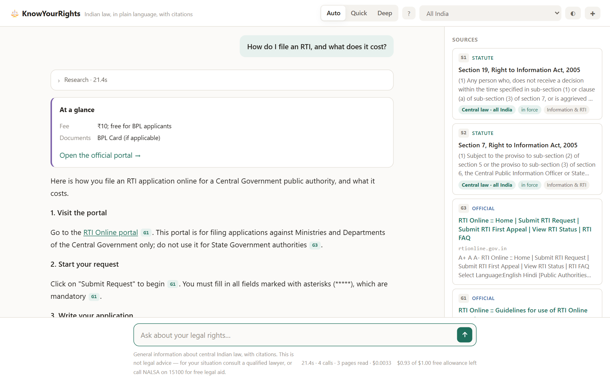
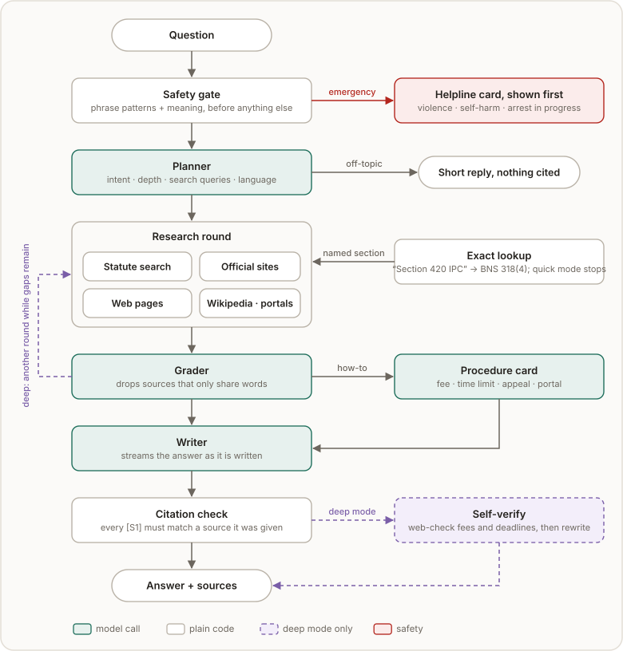

<div align="center">

# ⚖️ KnowYourRights

**Plain-language answers about Indian law, each claim linked to the section it comes from.**

English · हिन्दी · Hinglish

[](../../actions/workflows/tests.yml)




*General legal information, not legal advice.*

</div>

## Why it exists

Ask a general chatbot *"can the police arrest me without a warrant?"* and you get a fluent paragraph
you cannot check, often citing the Code of Criminal Procedure, which was repealed in July 2024.
KnowYourRights answers from the law itself and shows its work:

| | |
|---|---|
| **Cited to the section** | Every `[S1]` links to the provision it came from, and is checked before you see it. |
| **Current law** | IPC, CrPC and Evidence Act questions are answered under the 2023 codes (Section 420 IPC → Section 318 BNS). |
| **Honest about scope** | Off-topic questions are declined; state-law subjects are labelled and it asks which state. |
| **Official procedures** | For "how do I…" it reads government sites for the current fee, deadline, appeal and portal. |
| **Safety first** | A disclosure of violence, self-harm or an arrest in progress gets helpline numbers before anything else. |

## Results

| Measure | Result |
|---|---:|
| Right Act in the top 5 (42 citizen questions) | **100%** · MRR 0.929 |
| Off-topic questions refused | **8 / 8** |
| Named provisions fetched exactly ("Article 21", "Section 420 IPC") | **4 / 4** |
| Safety disclosures caught / false alarms | **33 / 33** / **0 / 26** |
| Browser test of 15 question types | **15 / 15** |
| Cost per answer | **$0.002–0.004** (deep research ~$0.015) |

How each was measured, and what degrades when an API is down: [EVALUATION.md](EVALUATION.md).

## How it works

<p align="center"></p>

**Models advise; code decides.** A model writes a validated plan, and plain Python runs it, so a
web page can never trigger a tool. Statute search is hybrid (meaning + keywords) over ~38,600
chunks of the Constitution, ~1,000 central Acts and the 2023 criminal codes. Full design:
[ARCHITECTURE.md](ARCHITECTURE.md).

## Run it

**You need** Python 3.11+, [Git LFS](https://git-lfs.com) and an
[OpenRouter API key](https://openrouter.ai/keys). No GPU; the app uses a few hundred MB of memory.

```bash
git clone https://github.com/DamnKuldeep/KnowYourRightsAI.git
cd KnowYourRightsAI
git lfs pull                              # the ~300 MB legal corpus

python -m venv .venv
source .venv/bin/activate                 # Windows: .venv\Scripts\activate
pip install -r requirements.txt
python -m playwright install chromium     # optional: reads pages that need JavaScript

cp .env.example .env                      # set OPENROUTER_API_KEY
python -m knowyourrights.server           # open http://127.0.0.1:8000
```

Stop it with <kbd>Ctrl</kbd>+<kbd>C</kbd>.

<details>
<summary><b>With Docker</b></summary>

```bash
cp .env.example .env                      # set OPENROUTER_API_KEY (KEY=value, no spaces)
docker compose up --build                 # http://127.0.0.1:8000
docker compose down                       # stop
```

`--build-arg INSTALL_BROWSER=false` gives a 1.9 GB image without Chromium (3.4 GB with it); set
`KYR_CRAWL_USE_BROWSER=false` to match.
</details>

<details>
<summary><b>From the terminal, without the web UI</b></summary>

```bash
python scripts/ask.py "can police search my phone"
python scripts/ask.py --search "right to information appeal"    # statute search only
```
</details>

## Configuration

Every setting is an environment variable (or a line in `.env`), listed with its default in
[`.env.example`](.env.example). The ones that matter most:

| Variable | Default | What it does |
|---|---|---|
| `OPENROUTER_API_KEY` | — | **Required.** Chat, embeddings and reranking. |
| `NVIDIA_API_KEY` | — | Optional backup chat provider. |
| `KYR_LOGIN_USERS` | — | `name:password,…` puts the whole site behind a sign-in page. |
| `KYR_CLIENT_BUDGET_USD` | `1.0` | Spend allowed per visitor (IP address) before a "free limit reached" popup. |
| `KYR_DAILY_BUDGET_USD` | `5.0` | Ceiling on the whole site's spend per day. |
| `KYR_MAX_ACTIVE_TURNS` | `5` | Answers researched at once; later questions wait in a visible queue. |
| `KYR_TRUST_PROXY_HEADERS` | `false` | Set `true` behind a reverse proxy or tunnel, or every visitor looks like one. |
| `KYR_ADMIN_TOKEN` | — | Bearer token for the `/api/status` diagnostics. |

## Putting it online

The server listens on `127.0.0.1` only. To publish it:

1. Put HTTPS in front: a reverse proxy such as [Caddy](https://caddyserver.com) or a
   [Cloudflare Tunnel](https://developers.cloudflare.com/cloudflare-one/connections/connect-networks/).
2. Set `KYR_TRUST_PROXY_HEADERS=true`, so per-visitor limits see real addresses.
3. Set `KYR_LOGIN_USERS` if only people you choose should use it, and lower
   `KYR_DAILY_BUDGET_USD` to what you are willing to spend.
4. Run it under a supervisor (systemd, or `restart: unless-stopped` in Docker) so it survives
   crashes and reboots. `/api/health` returns `ok`, `degraded` or `unavailable` (HTTP 503) for
   uptime checks.

A 2 GB machine is enough.

## API

| Method | Path | |
|---|---|---|
| `POST` | `/api/chat` | Ask a question; the answer streams back as server-sent events |
| `POST` | `/api/stop` · `/api/reset` | Stop the current answer · forget the conversation |
| `POST` | `/api/feedback` | Rate an answer |
| `GET` | `/api/config` · `/api/quota` | What the UI needs · this visitor's remaining allowance |
| `GET` | `/api/health` · `/api/status` | Health for monitors · full diagnostics (admin) |
| `GET` `POST` | `/login` · `POST /logout` | Sign in and out, when `KYR_LOGIN_USERS` is set |

Refusals return `{"error": {"kind", "message", "retry_after_s"}}` with a 4xx/5xx status.

## Development

```bash
pip install -r requirements-dev.txt
pytest                                    # 228 tests, ~10 s, no network or API key needed
ruff check knowyourrights scripts tests
python docs/diagrams.py                   # rebuild the diagrams in docs/
```

These scripts measure the real system and cost a few cents each:

| Script | Measures |
|---|---|
| `scripts/evaluate.py` | Retrieval quality; `--degraded fusion\|keywords` for API outages |
| `scripts/ui_check.py` | 15 kinds of question through the real browser UI, with screenshots |
| `scripts/e2e_check.py` | Whole answers: time to first word, stages, cost |
| `scripts/calibrate.py` · `calibrate_safety.py` | Abstention, citation and safety thresholds |
| `scripts/race_models.py` | Candidate models for each role, on the real prompts |

## Project layout

```text
knowyourrights/
  server/        HTTP routes, sign-in, validation, queue, per-visitor limits
  orchestrator/  one turn: plan → research → write → verify
  agents/        model stages (plan, grade, extract) and answer checks
  retrieval/     hybrid statute search, reranking, calibrated abstention
  llm/           model client: routing, failover, rate limits, cost
  tools/         statute lookup, web search, page reading, URL safety
  context/       conversation memory and token budgets
  web/           the browser UI (plain HTML, CSS, JS)
scripts/         evaluation, calibration, corpus repair, terminal client
tests/           the test suite
data/            the LanceDB corpus (Git LFS)
docs/            screenshot and diagrams
```

## Limitations

- **Central law.** State laws appear incidentally and are labelled; for state subjects (rent,
  stamp duty) the answer says so and asks which state.
- **A snapshot.** Amendments after the corpus was built are missing; deep mode re-checks fees and
  deadlines on the live web.
- **A small test set.** 42 retrieval questions, written by the author.
- **Not legal advice.** For your situation, consult a lawyer. Free legal aid: NALSA, **15100**.

## More

[ARCHITECTURE.md](ARCHITECTURE.md) · [EVALUATION.md](EVALUATION.md) ·
[CHANGELOG.md](CHANGELOG.md) · [The corpus](data/KnowYourRights_DB_README.md) ·
[MIT License](LICENSE)
