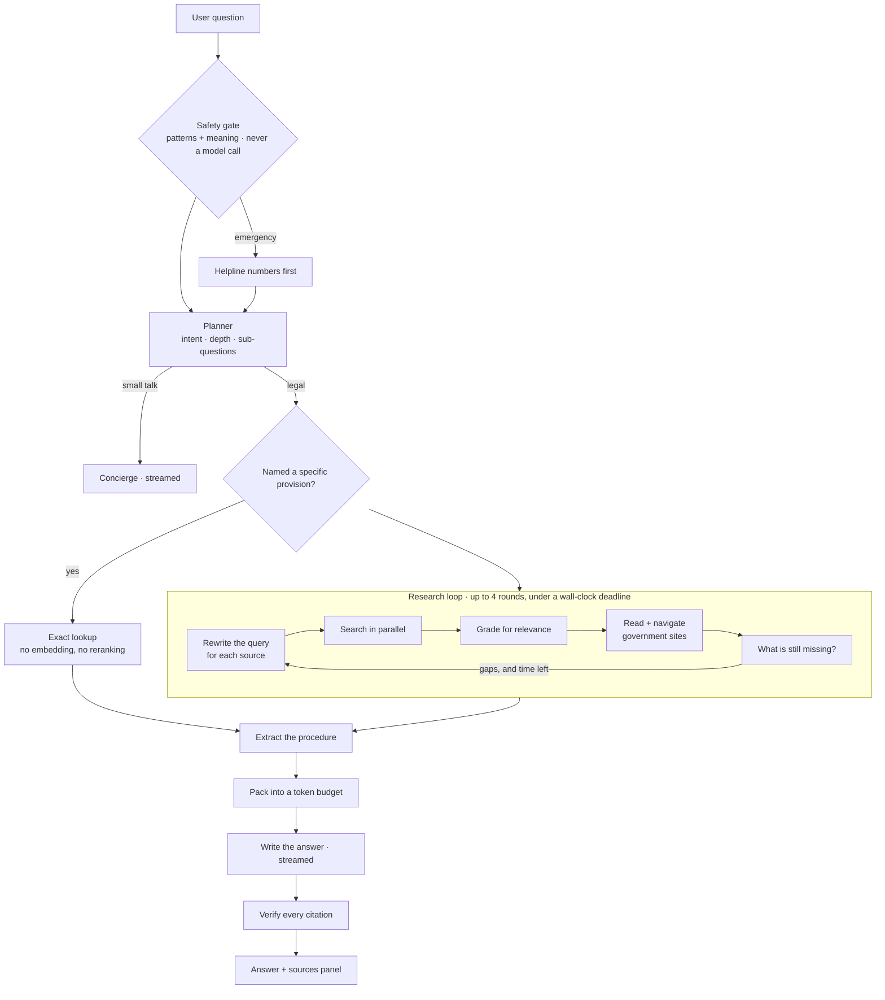
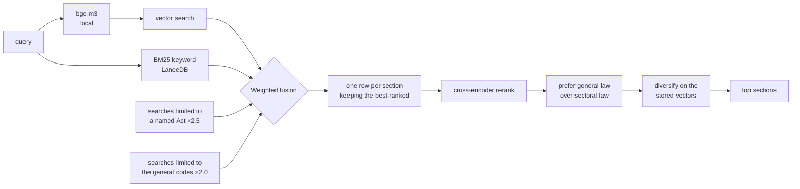

<div align="center">

# ⚖️ KnowYourRightsAI

**Ask about your rights under Indian law. Get a plain-language answer, with the actual
section it came from.**

English, Hindi, or Hinglish.

[](../../actions/workflows/tests.yml)


*General legal information, not legal advice.*

</div>

---

## Why I built this

If you ask a general-purpose chatbot "can the police arrest me without a warrant?", you get a
fluent, confident paragraph. It sounds right. You have no way to check it, and often it will
point you at the **Code of Criminal Procedure, 1973** — a law that was repealed on 1 July 2024
and replaced by the Bharatiya Nagarik Suraksha Sanhita.

That is a bad failure for a chatbot. For someone actually standing in a police station, it is
a much worse one.

So the goal here was narrower and harder than "a legal chatbot": every factual claim in an
answer should trace back to a specific section of a specific Act, and the system should be
willing to say *I don't have this* rather than produce something plausible.

Here is what a real answer looks like:

```
You:  What are my rights if the police arrest me without a warrant?

  ▸ Understanding your question          legal_question · standard
  ▸ Searching Indian law                 5 found · 1.7s
  ▸ Checking which sources are relevant  kept 5 of 7
  ▸ Writing the answer

You must be told the full grounds of your arrest immediately [S1]. You must be produced
before a magistrate without unnecessary delay [S2], and cannot be held more than 24 hours
without authorisation [S3]. If the offence is bailable, you must be told you are entitled
to bail and may arrange sureties [S1].

  ✓ 5 citations verified · 0 unresolvable
```

Every `[S1]` is a real, clickable section — checked against the retrieved evidence *before*
you see it. If the model had invented one, it would have been stripped out and flagged.

---

## How this got built

This didn't start as a package. It started as two Kaggle notebooks, and both are in
[`notebooks/`](notebooks/) because they are genuinely part of the work.

### Step one — building something to search

[**`01-building-database.ipynb`**](notebooks/01-building-database.ipynb) turns raw Indian
legal text into something retrievable:

> load three sources → clean → filter out repealed law → map to one schema → chunk by section
> → enrich each section with an LLM → embed → LanceDB → evaluate

Two decisions from this notebook shaped everything after it.

The first was **dropping the colonial criminal codes**. The IPC, CrPC and Indian Evidence Act
were replaced on 2024-07-01 by the BNS, BNSS and BSA. Rather than keep both and hope the
answer layer picks correctly, the old codes were removed from the corpus entirely. That single
choice is why this system doesn't cite repealed law — it *can't*, because the text isn't there.

The second was a **query-expansion trick**. Citizens don't write like statutes. So each section
was passed once through an LLM to generate the plain-language questions a person might ask that
it answers, plus keywords — and those were embedded *alongside* the statutory text. The thing
being searched isn't the law as written; it's the law as a person might ask about it.

Result: **38,890 chunks across 35,170 sections of 1,020 Acts**, with 1024-dimensional bge-m3
vectors and a BM25 index.

### Step two — a chatbot that worked

[**`02_The_Chatbot.ipynb`**](notebooks/02_The_Chatbot.ipynb) was the first working agent. Four
small agents — planner, grader, writer, concierge — coordinated by ordinary Python, with a
Gradio interface.

It got the most important thing right, and I kept it: **the orchestration is code, not an
agent loop.** The model emits a *validated plan* and Python executes it. A model that cannot
call tools cannot hallucinate a tool call — and, as it turned out later, a web page full of
hostile instructions cannot trigger one either.

It also proved the grader was worth its cost. A numerical relevance score can't tell "about
RTI" from "merely mentions an Act". A model reading the text can.

### Step three — what was missing

The notebook answered well when the answer was *in the corpus*. Its limits were structural:

- **One shot at retrieval.** Ask one question, search once, write. No way to notice a gap and
  go look again.
- **The web was snippets only.** A search result says a fee exists. It doesn't say what the fee
  *is*. Questions like "how do I file an RTI and what does it cost?" need a page actually read.
- **One rate limiter for everything**, so the cheap planner call and the expensive writer call
  competed for the same budget.
- **A notebook.** Not something you could hand to a person.

Closing those is what the rest of this repo is.

---

## What it does now



**It spends time in proportion to the question.** "What does Article 21 say" is a lookup and
takes about five seconds. "How do I file an RTI, what does it cost, and what's the deadline?"
runs several rounds, reads government pages, and takes half a minute. The planner decides;
you can override it.

**It reads the web properly.** For procedure questions, crawl4ai walks the actual portal —
`rtionline.gov.in` → *Submit Request* → *Guidelines* → *FAQ* — and comes back with the ₹10
fee, the BPL exemption, the 30-day deadline and the appeal route. Not a snippet.

**It knows when to stop.** Below a calibrated confidence threshold it says so and searches the
web instead of forcing a citation. All eight off-topic stress questions are declined, on both
the GPU and the deployed CPU configuration.

**It checks its own work.** In deep mode it reads back its own draft and asks which claims it
should not stand behind unverified — a fee, a deadline, anything supported by a single web page
— then runs targeted searches and rewrites with what they said. If it is confident, nothing is
spent.

**It never guesses jurisdiction.** Every statute carries CENTRAL, STATE or CONSTITUTION read
from the Act's own title, because the corpus's `jurisdiction` column says "central" for all
35,170 rows including the 53 state Acts that leaked in. Ask about a Mumbai deposit from Kerala
and it says plainly that the Maharashtra Rent Control Act applies only in Maharashtra.

**It won't run your machine out of memory.** On startup it measures free VRAM and RAM and picks
a configuration that leaves headroom. If the GPU runs out mid-query it halves the batch, then
falls back to CPU. A question never surfaces a CUDA error.

**Rate limits pause it, they don't break it.** A 429 shows a live countdown, backs off, and the
run continues where it left off — bounded by the turn's deadline rather than a retry count.

---

## The retrieval pipeline

This is where most of the work went.



Three parts of that deserve explaining, because they came from watching it fail.

**Why queries get rewritten.** "RTI" shares no words with "Right to Information Act, 2005", so
a raw search simply misses. A lookup table expands the common acronyms and redirects repealed
codes (IPC → BNS) before anything is searched. But the *expanded* text reads as broken English
— "how do I file an Right to Information Act, 2005" — so the reranker is given the original
phrasing instead. Expansion helps keyword search; it hurts a model reading a sentence.

**Why general law is weighted above sectoral law.** Dozens of Indian statutes grant *someone* a
power of arrest: forest officers, naval authorities, railway police. Their wording is nearly
identical to the criminal procedure code's. The cross-encoder scored the Essential Services
Maintenance Act at **0.994** and the correct BNSS section at **0.992** — it genuinely cannot
tell them apart, because textually they *are* alike. The difference isn't in the words, it's in
which statute governs the person asking. So that has to be applied deliberately rather than
hoped for from the model.

**Why diversity is computed on the stored vectors.** The original notebook re-encoded each
candidate's text to measure how similar the results were to each other. But the index holds
vectors of the *enriched* text, not the raw text. It was measuring diversity in a space that was
never searched. Reading the stored vectors back instead is both correct and faster.

---

## What the numbers say

One gold set of 42 questions written the way citizens ask, a stress set of 11 the system should
*refuse*, and 4 exact-lookup questions. Same sets everywhere below — every number on this page
comes from those, and nothing is quoted from a different run. Full methodology in
**[EVALUATION.md](EVALUATION.md)**.

### The two configurations that matter

| | Development laptop<br/><small>RTX 3050, rerank pool 24</small> | **Deployed box**<br/><small>1 CPU core, rerank pool 8</small> |
|---|---:|---:|
| Recall@1 | 78.6% | 76.2% |
| Recall@3 | 95.2% | 92.9% |
| **Recall@5** | **100%** | **95.2%** |
| Recall@10 | 100% | 97.6% |
| MRR | 0.873 | 0.854 |
| Exact lookups | 4/4 | 4/4 |
| **Off-topic answered anyway** | **0/8** | **0/8** |
| Median retrieval | 399 ms | 6.6 s |

Both are true. They are different machines running different pool sizes, and neither is "the"
number. The honest summary: **the top 5 almost always contains the right provision, and the
system refuses every off-topic question in both configurations.**

### Why 5 results, not 3 or 10

That Recall@10 column is the argument. On the laptop, Recall@5 and Recall@10 are *both* 100% —
nothing correct sits at rank 6–10, so fetching ten would add five irrelevant sections to the
writer's prompt for zero recall. Recall@3 drops to 95.2%, so cutting to three loses answers that
were retrieved successfully.

The deployed box has the same shape: 92.9% → 95.2% → 97.6%. Going from 5 to 10 buys 2.4 points
for double the prompt.

**`TOP_K = 5` is where recall stops improving faster than the prompt grows.** Recall@1 of ~78%
is also why the interface shows sources rather than asserting one answer: about one question in
five has its best hit at rank 2 or 3, and a person reading five cited sections finds it at once.

### Every configuration, measured

Free-tier hardware forces real trade-offs, so each was measured rather than argued:

| Configuration | Recall@5 | MRR | Off-topic caught | Retrieval | Why you would pick it |
|---|---:|---:|---:|---:|---|
| `balanced` GPU, pool 24 | 100% | 0.873 | 11/11 | 0.4 s | a GPU is available |
| `cpu`, pool 24 | 100% | 0.873 | 11/11 | 20 s | accuracy over speed |
| `cpu`, pool 12 | 95.2% | 0.849 | 10/11 | 11 s | *never — dominated by pool 8* |
| **`cpu`, pool 8** | **95.2%** | **0.861** | **10/11** | **6.6 s** | **the deployed default** |
| `cpu_lean`, no reranker | 93% | 0.787 | 5/11 | 0.09 s | too slow to demo otherwise |
| `lite`, BM25 only | 90.5% | 0.769 | 5/11 | 0.06 s | under 2 GB of RAM |

Three decisions fell out of this table.

**Pool 8, not 12.** Pool 12 was the deployed setting until it was measured against a control. It
has the same Recall@5 as pool 8, worse MRR, worse Recall@1, and runs 1.75× slower. Nothing was
bought with those four extra documents.

**Keep the cross-encoder, shrink its pool.** Dropping it is 70× faster and costs 7 points of
Recall@5 — survivable. It also takes off-topic rejection from 10/11 to 5/11, which is not:
without it the answerable and off-topic score populations overlap, so *no* threshold separates
them. Reranking 8 documents keeps the refusal at a third of the cost.

**The 100% row is real but not free.** Reaching it on CPU costs 20 seconds a question. The
deployed box trades 4.8 points of Recall@5 for a demo that responds — a deliberate choice made
because the target is a free-tier instance with one physical core, reversible with one line of
`.env`.

### Where the time goes

| Stage | Laptop (GPU) | Deployed (1 CPU core) |
|---|---:|---:|
| Embed the query | 61 ms | 331 ms |
| Vector search | 23 ms | **12 ms** |
| BM25 search | 23 ms | **8 ms** |
| Fetch rows + stored vectors | 47 ms | 19 ms |
| **Cross-encoder rerank** | **309 ms** | **6,625 ms** |
| Cold start | 56.7 s | **16.0 s** |

Vector search was **304 ms** before an ANN index existed — the corpus shipped without one and
every query scanned 159 MB. Building it took dense search to 23 ms and *raised* MRR from 0.837
to 0.849.

The small cloud box beats the laptop at search, BM25 and cold start. All of the difference is
the cross-encoder, and all of that is having one physical core.

**Accuracy is a property of the system; latency is a property of the box.** Same models, same
corpus, same ranking, so retrieval quality transferred exactly. The reverse held too: re-running
the benchmark while the laptop's GPU sat pinned in its lowest power state reproduced every
accuracy number and reported reranking at 2420 ms instead of 309. Nothing changed but a clock.

**A full answer** takes 5–8 s (`quick`), 10–25 s (`standard`) or 17–60 s (`deep`) — dominated by
the language model, not retrieval. When NVIDIA's endpoint degraded mid-evaluation the same turns
took 18 s, 26–120 s and 227 s, and retrieval still contributed under half a second to each.

---

## The numbers behind the knobs

Every constant was chosen against the gold set, and most are shaped by running on free tiers and
free hardware. That constraint is not an excuse; it is the design brief.

### Chunking and retrieval

| | Value | Why |
|---|---|---|
| Chunk size | **480 words, 80-word overlap** | Fixed by the corpus build. Sections shorter than this stay whole, and most are |
| Embedding | `BAAI/bge-m3`, 1024-d | **Cannot be changed** — the corpus is embedded with it, so a different model means re-embedding all 38,890 chunks |
| Embedder max sequence | 1024 tokens | Comfortably above a 480-word chunk |
| Reranker max sequence | 510 tokens | The cross-encoder's own position limit, not the embedder's. Exceeding it throws a CUDA index error rather than a clean one |
| `FETCH_K` | **25** per query | Candidates taken from each of dense and BM25, before fusion |
| `RERANK_POOL` | **8** deployed, 24 on GPU | Measured above |
| `TOP_K` | **5** | Where Recall@10 stops beating Recall@5 |
| `RRF_K` | 60 | Standard reciprocal-rank-fusion constant |
| MMR λ | 0.6 · 0.85 focused · **0.97 no-reranker** | Without a reranker MMR over-diversified and cost 5 points of Recall@5 |
| Act-filter weight | 2.5 | A named Act contributes an extra *weighted* ranked list, never a hard filter, which would kill recall |
| General-code boost | 0.25 | The Essential Services Maintenance Act outranked the BNSS on a policing question until general codes were preferred |

### Context and memory limits

Deliberately far below what the models accept. `nemotron-3-super` advertises a very large
window, but latency, free-tier credits and lost-in-the-middle all degrade long before it fills.

| | Value | Why |
|---|---|---|
| Writer input budget | **14,000 tokens** | The whole packed prompt, history included |
| Fast-stage input budget | **8,000 tokens** | Planner, grader, gap analyst — small calls kept small |
| Safety margin | 512 tokens | Reserved so a long answer cannot overrun the window |
| Conversation kept verbatim | **last 4 turns** | Older turns collapse into a cached running summary |
| Summary regenerated after | 8 turns | Past a threshold, not on every turn |
| Crawled page chunks | **1,400 chars**, top **3 kept** | Chunks are reranked against the sub-question before any reach a model |
| Web result cap | 1,800 chars per source | |
| Wikipedia cap | 1,200 chars | Background only — never cited as law |
| Packer | statute always keeps a slot | One large government page cannot crowd out the actual provision |

Follow-up questions reuse a cross-turn evidence pool keyed by section, so *"what about the
appeal?"* does not re-run the search. Starting a new conversation clears it — memory is
per-session and nothing is stored server-side between them.

### Depth budgets

| | Rounds | Web pages | Nav depth | Model calls | Deadline |
|---|---:|---:|---:|---:|---:|
| `quick` | 1 | 0 | — | 4 | 25 s |
| `standard` | 1 | 3 | 1 | 8 | 75 s |
| `deep` | 4 | 10 | 2 | 20 | 240 s |

Every one is a **soft ceiling that degrades**, never a hard failure. When time runs out the loop
stops gathering and writes with what it has. A shallower answer beats an error, and on a free
tier it is the outcome users actually hit.

### Working inside free tiers

Provider limits drove architecture, not just configuration:

| Constraint | What it forced |
|---|---|
| NVIDIA: 40 rpm **per model** | Cheap stages routed to a different model than the writer, so they draw on separate buckets |
| OpenRouter: ~20 rpm **shared** across all free models | Kept as failover rather than primary — measured, not assumed |
| Hard daily caps on both | A client-side ledger that survives restarts, so bouncing the server cannot quietly spend the allowance |
| Rate limits are normal, not exceptional | A 429 pauses and resumes with a countdown on screen; no turn is lost to one |
| Every free reranking endpoint returns 410/404 | Reranking has to be local, which is what makes CPU cost the dominant latency |
| 4 GB laptop GPU / 1-core cloud box | Five resource profiles, selected by probing the machine at startup |

Bigger models are not automatically better either. The largest free model available,
`nemotron-3-ultra-550b`, took **21.6 s** for a two-sentence answer against **2.8 s** for a 120B,
so it is kept last as an availability backstop rather than a first choice.

---

## When someone is not asking a legal question

Before any of the above runs — before the planner, before a single model call — the message
goes through a safety gate. Someone typing *"he is hitting me right now"* needs 112, not a
citation, and needs it even if every provider is rate-limited or down.

| | |
|---|---|
| Disclosures caught | **33 / 33** |
| False alarms on legal questions | **0 / 26** |
| Cost | one embedding, which retrieval then reads from cache |

It has two tiers. **Patterns** are instant and exact and cannot generalise. **Meaning** compares
the message against curated exemplars of each crisis — written the way frightened people write,
in English, Hindi and Hinglish — using the embedder already loaded for search.

Getting it right meant fixing errors in both directions. *"I was molested"* did not fire,
because the pattern demanded `being molested` and past tense is how people actually report.
*"is suicide a crime in India"* did fire, because bare topic nouns are the vocabulary of the
crime and of every legal question about it. Patterns are now marked strong or weak: strong ones
carry a subject or object and fire unconditionally, weak ones are suppressed when the message
reads as a question about the law.

Try it: `my husband is hitting me` · `I was molested` · `my partner keeps hurting me and I'm
scared to go home` (no literal pattern matches that last one). Then try `what is the punishment
for rape` and `child labour laws in India`, which must stay quiet.

Both labelled sets are in [`knowyourrights/safety_eval.py`](knowyourrights/safety_eval.py), and
`python scripts/calibrate_safety.py` re-measures the trade — weighting a miss four times a
false alarm, because they are not equally bad.

---

## Every guardrail, in one place

A tool that cites statute at people can be wrong in ways an ordinary chatbot cannot. These are
all the checks, what each one prevents, and how you can see it working.

| # | Guardrail | Prevents | Runs |
|---|---|---|---|
| 1 | **Emergency gate** | A person in danger reading about the law instead of calling 112 | Before any model call |
| 2 | **Repealed-law block** | Citing the IPC or CrPC, repealed 2024-07-01 | Corpus + writer prompt |
| 3 | **Jurisdiction labelling** | Implying a state Act applies nationwide | On every statute |
| 4 | **Abstention threshold** | Inventing a section number when retrieval found nothing good | After reranking |
| 5 | **Grader** | Citing a section that merely mentions the Act | After retrieval |
| 6 | **Citation verifier** | A marker like `[S3]` pointing at nothing | After the answer streams |
| 7 | **Quote check** | A quotation that is not a real substring of its source | After the answer streams |
| 8 | **Diversity floor** | A government page crowding the statute out of the prompt | While packing |
| 9 | **Prompt-injection isolation** | A crawled page instructing the model | Before web text reaches a model |
| 10 | **Code-orchestrated tools** | A hallucinated or page-triggered tool call | By construction |
| 11 | **Self-verification** | Standing behind a fee or deadline it is unsure of | Deep mode |
| 12 | **Empty-answer fallback** | Sources and a research log with no answer under them | If the writer returns nothing |
| 13 | **Currency stamps** | Presenting a snapshot as today's law | On every answer |

### 1 — The emergency gate

First in the pipeline, and it never makes a model call, so a rate limit cannot delay a helpline
number. Two tiers: patterns for literal phrasings, and meaning for the paraphrases patterns
cannot reach. **33/33 disclosures caught, 0/26 false alarms.** Detail and how to test it in the
section above.

### 2 — Repealed law

The IPC, CrPC and Indian Evidence Act were repealed on **2024-07-01**. They are absent from the
corpus entirely, so they cannot be retrieved — but a model can still recall them from training,
so the writer prompt forbids citing them and the system substitutes BNS / BNSS / BSA with the
substitution stated. This came from watching an early build cite CrPC §41 from memory.

### 3 — Jurisdiction

53 state Acts leaked into the corpus from the source dataset, and the corpus's own
`jurisdiction` column says `central` for **every** row — so it cannot be trusted. The Act title
is the signal used instead. A state Act is labelled `STATE LAW`, and when your selected state
does not match, the answer says so outright rather than implying coverage. Verified live: a
Mumbai deposit question asked from Kerala produced *"the Maharashtra Rent Control Act, 1999
applies only in Maharashtra"*.

### 4 — Abstention

If the best hit scores below a **calibrated** threshold, the system says the corpus has no good
answer and pivots to the web rather than manufacturing a section number. The threshold is
derived per configuration, not chosen — see *Calibration* below. **0 of 8 off-topic questions
are answered**, in both the GPU and deployed configurations.

### 5–7 — Citations

The grader drops sections that merely *mention* the right Act. After the answer streams, a code
verifier confirms every `[S1]` resolves to packed evidence and that any quoted string is a real
substring of its source; markers that fail are stripped and the count is reported in the panel.
No model is involved in that check.

### 8 — The diversity floor

The packer guarantees at least one statute and one web source survive if both exist. Without it
a single large government page can consume the whole budget and the actual provision never
reaches the writer — which is the specific failure this system exists to prevent.

### 9–10 — Hostile web content

Crawled pages are stripped of scripts and hidden text, length-capped, and wrapped in a delimited
block marked as data, never instructions. More fundamentally: **the model never chooses to call
a tool.** It emits a validated plan and Python executes it. A model that cannot call tools
cannot hallucinate a call, and a web page full of instructions cannot trigger one either.

### 11 — Self-verification

In deep mode the system asks itself which claims it would not want to be wrong about — fees,
deadlines, thin support — runs up to two targeted web checks, and rewrites if what it finds
contradicts the draft.

### 12 — When the writer produces nothing

A writer that fails *loudly* was always handled. A writer that returns cleanly with zero tokens
was not: the turn completed "successfully" and left correct sources with no answer beneath them.
It now falls back to a plain digest of the provisions found, with a notice.

### 13 — Currency

Answers are framed against the corpus snapshot date, `status` and `act_year` ride with every
citation as badges, and deep mode runs an amendment check on cited Acts.

---

## Things that only broke when I ran it

Almost every interesting bug here was invisible in the code and obvious the moment a real
question went through. Keeping the list because the debugging was most of the work.

**The database froze on the first query.** Building the section index took a lock, then called
the table property, which took the *same* lock. A plain `Lock` isn't reentrant. Classic, and
completely silent — no error, just a process sitting there.

**My own tests broke production.** A test that mocks a model returning "410 Gone" to check
failover was writing that verdict to the real runtime directory, because the file path was
computed at import time and escaped the test fixture. The app quietly ran on its backup model
for a while before I noticed it in a usage log.

**Portal navigation kept reaching exactly one page.** crawl4ai caches by URL, not by fetch
engine. An earlier browser fetch had cached the page, so when the HTTP fetcher asked for it,
the cache handed it back and everything looked healthy — on a site where the HTTP fetcher
actually returns `success=False` and zero links. The fix was to probe with the cache bypassed
and remember, per host, which engine really works. That took navigation from 1 page to 6, and
that is the difference between "here's the portal" and "here's the fee, the deadline and the
appeal route".

**Adding section headings made things worse.** Reasoning that a cross-encoder does better with
a title, I prepended each section's heading. Results got *worse* — the correct Article 22
dropped out of the top five entirely. Checking the data: `section_name` is populated for the
1,059 criminal-code sections and **empty for all 34,111 other sections**. So for 97% of the
corpus I was prepending an empty label and a citation line — pure noise. Now it's added only
where a heading actually exists, and the criminal code benefits without everything else paying.

**The answer cited `[S6]` when only five sources existed.** Citation ids are assigned per turn,
but conversation history carried old markers into the next question and the model copied them
forward. In one Hinglish answer it even annotated its own confusion mid-sentence. Markers are
now stripped from history.

**Citation chips pointed at nothing.** The sources panel filled during research, but the packer
re-assigns ids afterwards and can add evidence recalled from earlier turns. The panel and the
answer had drifted apart. A final `sources_final` event now replaces the panel with exactly the
set the writer was given.

**"What is anticipatory bail" returned nothing at all** — while the correct provision, BNSS
§483, sat right there in the results. I had tied two thresholds together that answer different
questions: *is the best hit good enough to answer at all* versus *may this individual hit be
shown to the grader*. Untangling them moved the citation floor from 0.137 to 0.02.

**It recommended a repealed law.** Asked about anticipatory bail with weak sources, the writer
fell back on its own memory and pointed at the CrPC, 1973. The corpus deliberately doesn't
contain it, but the model still knew it. Now the writer is explicitly told that reaching for the
CrPC means it is working from stale memory rather than its sources.

**The grader rejected all six correct sections.** My relevance instructions had vivid negative
examples — "a forest officer's power of arrest is not about your rights" — and the model
over-generalised them into rejecting the real criminal procedure code too. Softened the rules,
and added a rescue: if grading rejects *everything* while retrieval was confident, keep the top
statutes anyway. An empty answer built on good retrieval is never the better outcome.

**Thirty seconds burned per research step, finding nothing.** The planner had started putting
URLs into search queries, so the system was web-searching for a URL string and then crawling
whatever came back. A repair pass now converts a URL-shaped query into a navigation step.

**An English question got answered in Hindi.** I had asked the planner to detect the language
and it simply got it wrong. Language detection moved into code — script for Devanagari, function
words for Hinglish. The first version of that had its own bug: I'd included Hindi "the" (meaning
*were*) in the marker list, which collides with English "the", so "what is the punishment for
cheating" was classified as Hinglish.

One useful discovery along the way: `chat_template_kwargs={"thinking": false}` cuts Nemotron 3's
output from 63 tokens to 11 on the structured stages. The documented Llama-Nemotron way of
turning off reasoning doesn't work on Nemotron 3 at all.

---

## Calibration, and why it matters more than it sounds

The notebook shipped an abstention threshold of `0.05`. I inherited it without thinking.

Then I swapped the reranker — which is fine to do, a cross-encoder reads text and doesn't care
about the corpus — and the threshold quietly stopped meaning anything, because a different model
produces a different distribution of scores. Half the off-topic questions were getting confident
answers.

[`scripts/calibrate.py`](scripts/calibrate.py) now derives the thresholds by running questions
the corpus *can* answer against questions it *can't*, and placing the cut in the gap. On this
setup that moved the threshold to 0.083 and took off-topic answers from 1-in-2 to **0-in-8**.

It's stored per backend *and* model, so changing either invalidates it. That's the sort of
thing that silently rots if it isn't measured.

---

## Running it

The corpus ships with the repo through Git LFS, so a clone is immediately usable. Install
[git-lfs](https://git-lfs.com) first — without it you get 134-byte pointer files instead of a
350 MB database, and a confusing startup failure.

```bash
git lfs install
git clone https://github.com/DamnKuldeep/KnowYourRightsAI.git
cd KnowYourRightsAI
pip install -r requirements.txt
cp .env.example .env          # add NVIDIA_API_KEY — free from build.nvidia.com

python scripts/probe_resources.py   # what this machine can run
python scripts/build_index.py       # vector index — 23s, and worth 300ms per query
python scripts/probe_models.py         # which models the key can reach
python scripts/calibrate.py         # thresholds — genuinely don't skip this

python -m knowyourrights.server     # http://127.0.0.1:8000
```

Without a browser:

```bash
python scripts/try_agent.py "how do I file an RTI and what does it cost"
python scripts/try_search.py --multi   # retrieval only — no LLM, no API credits
python scripts/eval.py --verbose       # the numbers above
python scripts/eval.py --compare       # A/B the ranking settings against each other
```

The whole thing adapts to the machine it finds. On a 4 GB laptop GPU it runs both models
locally; on a CPU-only box it keeps the embedder local, because the corpus is tied to it.

And on a box too small for a 2.3 GB model — a free-tier `t4g.small`, say — `KYR_PROFILE=lite`
loads **nothing at all** and runs on BM25 alone: **Recall@5 90.5% at ~60 ms in under 1 GB**,
against 100% at ~400 ms for the full GPU pipeline. It holds up because the keyword index covers the
LLM-generated *citizen questions* from the corpus build, so it is already searching the way
people ask.

---

## What's in here

```
knowyourrights/
  config.py         every setting, in one file
  legal_terms.py    acronyms, repeals, corpus gaps, language detection
  orchestrator.py   the research loop
  safety.py         the emergency gate — patterns, then meaning
  safety_eval.py    33 labelled disclosures, 26 legal questions that must not fire
  retrieval/        the search pipeline
  tools/            statute · web · crawler · wikipedia
  context/          token budgets, page reduction, conversation memory
  agents/           prompts, schemas, the pipeline stages
  runtime/          resource probe, GPU scheduling, caching
  server.py         FastAPI + server-sent events
  web/              the interface — plain HTML, CSS and JS, no build step

notebooks/          01 built the database · 02 was the first chatbot
scripts/            probes, index build, calibration, evaluation, CLI harnesses
  build_index.py      the ANN index — 304 ms of dense search becomes 23 ms
  calibrate.py        abstention thresholds, per reranker configuration
  calibrate_safety.py the safety gate's threshold, with the whole trade curve
  benchmark.py        corpus, accuracy, abstention and stage latency
  deploy_report.py    renders a benchmark as markdown; diffs two machines
tests/              100 tests, fully mocked — no GPU, no network, no API credits
data/               the corpus itself (Git LFS)
deploy/             one-shot installer, tunnel service, waker, idle timer
Dockerfile          CPU image, x86_64 and ARM64
docker-compose.yml  corpus mounted, model weights in a volume
```

| Document | |
|---|---|
| **[ARCHITECTURE.md](ARCHITECTURE.md)** | Diagrams of the whole pipeline — what runs, when, and why it is there rather than something simpler. Start here. |
| **[EVALUATION.md](EVALUATION.md)** | The full report — what's in the corpus, the question sets, per-category accuracy, stage-by-stage latency, and the changes that moved each number. |
| **[DEPLOY_AWS.md](DEPLOY_AWS.md)** | A demo that sleeps when idle and wakes when someone opens the link — ~$15 for six months — plus the production failures worth pre-empting. |

Deploying is one paste on a fresh Ubuntu 24.04 box:

```bash
curl -fsSL https://raw.githubusercontent.com/DamnKuldeep/KnowYourRightsAI/main/deploy/setup-ec2.sh -o setup.sh
bash setup.sh                    # keys, corpus, index, calibration, service, idle timer
bash deploy/tunnel.sh start      # a public URL that survives closing the terminal
```

**Two providers, free tiers only.** NVIDIA NIM and OpenRouter both serve every role, and any
stage can fail over between them. The order is measured, not assumed
([`scripts/race_models.py`](scripts/race_models.py)): NVIDIA leads because its limit is 40
requests/minute *per model* while OpenRouter shares ~20/min across all free models — and the
cheap stages fire 4–6 times per question. Bigger is not better either; the largest free model
available, `nemotron-3-ultra-550b`, took **21.6 s** for a two-sentence answer against 2.8 s for
a 120B, so it is kept last as an availability backstop.

Docker, if you'd rather not install anything:

```bash
cp .env.example .env && docker compose up --build
docker compose exec app python scripts/build_index.py   # first run only
docker compose exec app python scripts/calibrate.py
```

The image holds neither the corpus nor the model weights — the corpus is mounted read-only from
the clone and the models live in a named volume, so rebuilds don't re-download bge-m3. It comes
to **3.34 GB**; baking both in would push it near 6 GB.

On Windows use `docker compose` rather than `docker run -v`: Git Bash silently rewrites
`/data:ro` into a Windows path and the mount lands somewhere useless.

| Script | |
|---|---|
| `build_index.py` | Builds the vector index. **Run once** — without it every query scans 159 MB. |
| `calibrate.py` | Derives the abstention thresholds for whichever reranker you're using. |
| `benchmark.py` | The measurements in EVALUATION.md. `--all` is free; `--e2e` spends credits. |
| `eval.py` | Recall/MRR against the gold set; `--compare` A/Bs the ranking settings. |
| `probe_resources.py` / `probe_models.py` | What this machine can run; which models the key can reach. |
| `try_search.py` / `try_tools.py` / `try_agent.py` | Retrieval, each tool, and the whole agent from the terminal. |

---

## What it can't do

**It only knows central law.** Rent, land, stamp duty and cooperative societies are state
subjects, and the corpus covers them only by accident. When a question is a state matter, the
system says so and searches the web rather than pretending otherwise.

**It's accurate as of a snapshot.** Amendments after the corpus was built aren't in the data.
Deep mode checks the web for recent changes, but anything time-sensitive is worth verifying.

**Some laws simply aren't in it** — the Prevention of Money Laundering Act and the Digital
Personal Data Protection Act among them. It names the gap instead of citing something that
merely sounds close.

**Relevance grading is still a model call**, and it varies between runs. It occasionally
over-rejects and thins out an answer. There's a safety net for total rejection; partial
over-rejection is the main thing I'd work on next.

---

## Credits

Corpus assembled from [`mratanusarkar/Indian-Laws`](https://huggingface.co/datasets/mratanusarkar/Indian-Laws)
and [`Sharathhebbar24/Indian-Constitution`](https://huggingface.co/datasets/Sharathhebbar24/Indian-Constitution),
plus the 2023 sanhita texts. Search on [LanceDB](https://lancedb.com) with
[bge-m3](https://huggingface.co/BAAI/bge-m3). Web reading by
[crawl4ai](https://github.com/unclecode/crawl4ai). Language models on
[NVIDIA NIM](https://build.nvidia.com).

MIT licensed. Statutory text is public-domain government material.

<div align="center">
<sub>This gives general legal information, not legal advice. For your own situation talk to a
lawyer — free legal aid is available from NALSA on <b>15100</b>.</sub>
</div>
