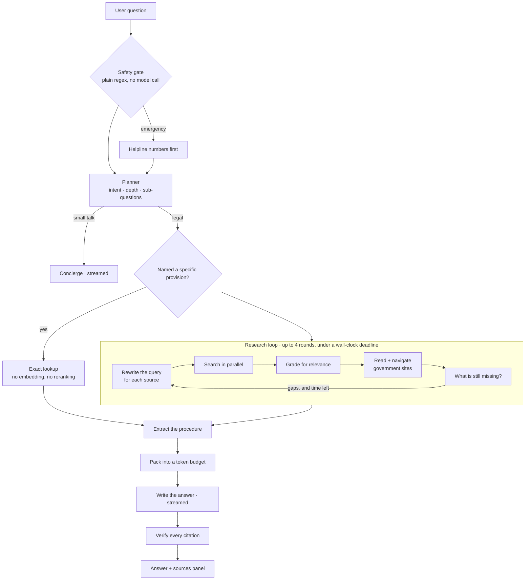
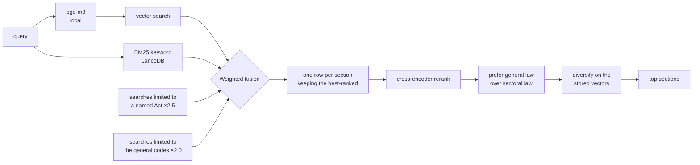

<div align="center">

# ⚖️ KnowYourRightsAI

**Ask about your rights under Indian law. Get a plain-language answer, with the actual
section it came from.**

English, Hindi, or Hinglish.

[](../../actions/workflows/tests.yml)


*General legal information, not legal advice.*

</div>

---

## Why I built this

If you ask a general-purpose chatbot "can the police arrest me without a warrant?", you get a
fluent, confident paragraph. It sounds right. You have no way to check it, and often it will
point you at the **Code of Criminal Procedure, 1973** — a law that was repealed on 1 July 2024
and replaced by the Bharatiya Nagarik Suraksha Sanhita.

That is a bad failure for a chatbot. For someone actually standing in a police station, it is
a much worse one.

So the goal here was narrower and harder than "a legal chatbot": every factual claim in an
answer should trace back to a specific section of a specific Act, and the system should be
willing to say *I don't have this* rather than produce something plausible.

Here is what a real answer looks like:

```
You:  What are my rights if the police arrest me without a warrant?

  ▸ Understanding your question          legal_question · standard
  ▸ Searching Indian law                 5 found · 1.7s
  ▸ Checking which sources are relevant  kept 5 of 7
  ▸ Writing the answer

You must be told the full grounds of your arrest immediately [S1]. You must be produced
before a magistrate without unnecessary delay [S2], and cannot be held more than 24 hours
without authorisation [S3]. If the offence is bailable, you must be told you are entitled
to bail and may arrange sureties [S1].

  ✓ 5 citations verified · 0 unresolvable
```

Every `[S1]` is a real, clickable section — checked against the retrieved evidence *before*
you see it. If the model had invented one, it would have been stripped out and flagged.

---

## How this got built

This didn't start as a package. It started as two Kaggle notebooks, and both are in
[`notebooks/`](notebooks/) because they are genuinely part of the work.

### Step one — building something to search

[**`01-building-database.ipynb`**](notebooks/01-building-database.ipynb) turns raw Indian
legal text into something retrievable:

> load three sources → clean → filter out repealed law → map to one schema → chunk by section
> → enrich each section with an LLM → embed → LanceDB → evaluate

Two decisions from this notebook shaped everything after it.

The first was **dropping the colonial criminal codes**. The IPC, CrPC and Indian Evidence Act
were replaced on 2024-07-01 by the BNS, BNSS and BSA. Rather than keep both and hope the
answer layer picks correctly, the old codes were removed from the corpus entirely. That single
choice is why this system doesn't cite repealed law — it *can't*, because the text isn't there.

The second was a **query-expansion trick**. Citizens don't write like statutes. So each section
was passed once through an LLM to generate the plain-language questions a person might ask that
it answers, plus keywords — and those were embedded *alongside* the statutory text. The thing
being searched isn't the law as written; it's the law as a person might ask about it.

Result: **38,890 chunks across 35,170 sections of 1,020 Acts**, with 1024-dimensional bge-m3
vectors and a BM25 index.

### Step two — a chatbot that worked

[**`02_The_Chatbot.ipynb`**](notebooks/02_The_Chatbot.ipynb) was the first working agent. Four
small agents — planner, grader, writer, concierge — coordinated by ordinary Python, with a
Gradio interface.

It got the most important thing right, and I kept it: **the orchestration is code, not an
agent loop.** The model emits a *validated plan* and Python executes it. A model that cannot
call tools cannot hallucinate a tool call — and, as it turned out later, a web page full of
hostile instructions cannot trigger one either.

It also proved the grader was worth its cost. A numerical relevance score can't tell "about
RTI" from "merely mentions an Act". A model reading the text can.

### Step three — what was missing

The notebook answered well when the answer was *in the corpus*. Its limits were structural:

- **One shot at retrieval.** Ask one question, search once, write. No way to notice a gap and
  go look again.
- **The web was snippets only.** A search result says a fee exists. It doesn't say what the fee
  *is*. Questions like "how do I file an RTI and what does it cost?" need a page actually read.
- **One rate limiter for everything**, so the cheap planner call and the expensive writer call
  competed for the same budget.
- **A notebook.** Not something you could hand to a person.

Closing those is what the rest of this repo is.

---

## What it does now



**It spends time in proportion to the question.** "What does Article 21 say" is a lookup and
takes about five seconds. "How do I file an RTI, what does it cost, and what's the deadline?"
runs several rounds, reads government pages, and takes half a minute. The planner decides;
you can override it.

**It reads the web properly.** For procedure questions, crawl4ai walks the actual portal —
`rtionline.gov.in` → *Submit Request* → *Guidelines* → *FAQ* — and comes back with the ₹10
fee, the BPL exemption, the 30-day deadline and the appeal route. Not a snippet.

**It knows when to stop.** Below a calibrated confidence threshold it says so and searches the
web instead of forcing a citation. Eight off-topic questions in a row get declined.

**It won't run your machine out of memory.** On startup it measures free VRAM and RAM and picks
a configuration that leaves headroom. If the GPU runs out mid-query it halves the batch, then
falls back to CPU. A question never surfaces a CUDA error.

**Rate limits pause it, they don't break it.** A 429 shows a live countdown, backs off, and the
run continues where it left off — bounded by the turn's deadline rather than a retry count.

---

## The retrieval pipeline

This is where most of the work went.



Three parts of that deserve explaining, because they came from watching it fail.

**Why queries get rewritten.** "RTI" shares no words with "Right to Information Act, 2005", so
a raw search simply misses. A lookup table expands the common acronyms and redirects repealed
codes (IPC → BNS) before anything is searched. But the *expanded* text reads as broken English
— "how do I file an Right to Information Act, 2005" — so the reranker is given the original
phrasing instead. Expansion helps keyword search; it hurts a model reading a sentence.

**Why general law is weighted above sectoral law.** Dozens of Indian statutes grant *someone* a
power of arrest: forest officers, naval authorities, railway police. Their wording is nearly
identical to the criminal procedure code's. The cross-encoder scored the Essential Services
Maintenance Act at **0.994** and the correct BNSS section at **0.992** — it genuinely cannot
tell them apart, because textually they *are* alike. The difference isn't in the words, it's in
which statute governs the person asking. So that has to be applied deliberately rather than
hoped for from the model.

**Why diversity is computed on the stored vectors.** The original notebook re-encoded each
candidate's text to measure how similar the results were to each other. But the index holds
vectors of the *enriched* text, not the raw text. It was measuring diversity in a space that was
never searched. Reading the stored vectors back instead is both correct and faster.

---

## What the numbers say

Measured with [`scripts/eval.py`](scripts/eval.py) against a 42-question gold set covering all
18 categories of the corpus taxonomy, plus stress questions designed to *fail*.

| | Notebook | Now |
|---|---|---|
| Recall@5 | 95% | **98%** (41/42) |
| MRR | 0.783 | **0.837** |
| Answer is the top hit | 67% | **74%** |
| Exact "what does Article 21 say" lookups | — | **4/4** |
| Off-topic questions it answers anyway | 1 in 2 | **0 in 8** |

That last row is the one I care about most, and it came entirely from calibration — see below.

**How long it takes** (RTX 3050, GPU config):

| | | |
|---|---|---|
| `quick` | a lookup | 5–8 s |
| `standard` | statute + grading | 10–25 s |
| `deep` | multiple rounds, reads official sites | 17–60 s |

**What it costs to run:** bge-m3 in fp16 is 1090 MiB of VRAM; the reranker adds 760 MiB;
reranking 25 documents takes 0.39 s. The first query pays a 1.86 s CUDA warmup, so the server
warms up at startup and every query after that encodes in ~25 ms.

---

## Things that only broke when I ran it

Almost every interesting bug here was invisible in the code and obvious the moment a real
question went through. Keeping the list because the debugging was most of the work.

**The database froze on the first query.** Building the section index took a lock, then called
the table property, which took the *same* lock. A plain `Lock` isn't reentrant. Classic, and
completely silent — no error, just a process sitting there.

**My own tests broke production.** A test that mocks a model returning "410 Gone" to check
failover was writing that verdict to the real runtime directory, because the file path was
computed at import time and escaped the test fixture. The app quietly ran on its backup model
for a while before I noticed it in a usage log.

**Portal navigation kept reaching exactly one page.** crawl4ai caches by URL, not by fetch
engine. An earlier browser fetch had cached the page, so when the HTTP fetcher asked for it,
the cache handed it back and everything looked healthy — on a site where the HTTP fetcher
actually returns `success=False` and zero links. The fix was to probe with the cache bypassed
and remember, per host, which engine really works. That took navigation from 1 page to 6, and
that is the difference between "here's the portal" and "here's the fee, the deadline and the
appeal route".

**Adding section headings made things worse.** Reasoning that a cross-encoder does better with
a title, I prepended each section's heading. Results got *worse* — the correct Article 22
dropped out of the top five entirely. Checking the data: `section_name` is populated for the
1,059 criminal-code sections and **empty for all 34,111 other sections**. So for 97% of the
corpus I was prepending an empty label and a citation line — pure noise. Now it's added only
where a heading actually exists, and the criminal code benefits without everything else paying.

**The answer cited `[S6]` when only five sources existed.** Citation ids are assigned per turn,
but conversation history carried old markers into the next question and the model copied them
forward. In one Hinglish answer it even annotated its own confusion mid-sentence. Markers are
now stripped from history.

**Citation chips pointed at nothing.** The sources panel filled during research, but the packer
re-assigns ids afterwards and can add evidence recalled from earlier turns. The panel and the
answer had drifted apart. A final `sources_final` event now replaces the panel with exactly the
set the writer was given.

**"What is anticipatory bail" returned nothing at all** — while the correct provision, BNSS
§483, sat right there in the results. I had tied two thresholds together that answer different
questions: *is the best hit good enough to answer at all* versus *may this individual hit be
shown to the grader*. Untangling them moved the citation floor from 0.137 to 0.02.

**It recommended a repealed law.** Asked about anticipatory bail with weak sources, the writer
fell back on its own memory and pointed at the CrPC, 1973. The corpus deliberately doesn't
contain it, but the model still knew it. Now the writer is explicitly told that reaching for the
CrPC means it is working from stale memory rather than its sources.

**The grader rejected all six correct sections.** My relevance instructions had vivid negative
examples — "a forest officer's power of arrest is not about your rights" — and the model
over-generalised them into rejecting the real criminal procedure code too. Softened the rules,
and added a rescue: if grading rejects *everything* while retrieval was confident, keep the top
statutes anyway. An empty answer built on good retrieval is never the better outcome.

**Thirty seconds burned per research step, finding nothing.** The planner had started putting
URLs into search queries, so the system was web-searching for a URL string and then crawling
whatever came back. A repair pass now converts a URL-shaped query into a navigation step.

**An English question got answered in Hindi.** I had asked the planner to detect the language
and it simply got it wrong. Language detection moved into code — script for Devanagari, function
words for Hinglish. The first version of that had its own bug: I'd included Hindi "the" (meaning
*were*) in the marker list, which collides with English "the", so "what is the punishment for
cheating" was classified as Hinglish.

One useful discovery along the way: `chat_template_kwargs={"thinking": false}` cuts Nemotron 3's
output from 63 tokens to 11 on the structured stages. The documented Llama-Nemotron way of
turning off reasoning doesn't work on Nemotron 3 at all.

---

## Calibration, and why it matters more than it sounds

The notebook shipped an abstention threshold of `0.05`. I inherited it without thinking.

Then I swapped the reranker — which is fine to do, a cross-encoder reads text and doesn't care
about the corpus — and the threshold quietly stopped meaning anything, because a different model
produces a different distribution of scores. Half the off-topic questions were getting confident
answers.

[`scripts/calibrate.py`](scripts/calibrate.py) now derives the thresholds by running questions
the corpus *can* answer against questions it *can't*, and placing the cut in the gap. On this
setup that moved the threshold to 0.083 and took off-topic answers from 1-in-2 to **0-in-8**.

It's stored per backend *and* model, so changing either invalidates it. That's the sort of
thing that silently rots if it isn't measured.

---

## Running it

The corpus ships with the repo through Git LFS, so a clone is immediately usable. Install
[git-lfs](https://git-lfs.com) first — without it you get 134-byte pointer files instead of a
350 MB database, and a confusing startup failure.

```bash
git lfs install
git clone https://github.com/DamnKuldeep/KnowYourRightsAI.git
cd KnowYourRightsAI
pip install -r requirements.txt
cp .env.example .env          # add NVIDIA_API_KEY — free from build.nvidia.com

python scripts/probe_resources.py   # what this machine can run
python scripts/probe_nim.py         # which models the key can reach
python scripts/calibrate.py         # thresholds — genuinely don't skip this

python -m knowyourrights.server     # http://127.0.0.1:8000
```

Without a browser:

```bash
python scripts/try_agent.py "how do I file an RTI and what does it cost"
python scripts/try_search.py --multi   # retrieval only — no LLM, no API credits
python scripts/eval.py --verbose       # the numbers above
python scripts/eval.py --compare       # A/B the ranking settings against each other
```

The whole thing adapts to the machine it finds. On a 4 GB laptop GPU it runs both models
locally. On a CPU-only box it keeps the embedder local (it has to — the corpus is tied to it)
and sends reranking to the API, because reranking on a CPU takes 10 seconds and everything else
takes one.

---

## What's in here

```
knowyourrights/
  config.py         every setting, in one file
  legal_terms.py    acronyms, repeals, corpus gaps, language detection
  orchestrator.py   the research loop
  retrieval/        the search pipeline
  tools/            statute · web · crawler · wikipedia
  context/          token budgets, page reduction, conversation memory
  agents/           prompts, schemas, the pipeline stages
  runtime/          resource probe, GPU scheduling, caching
  server.py         FastAPI + server-sent events
  web/              the interface — plain HTML, CSS and JS, no build step

notebooks/          01 built the database · 02 was the first chatbot
scripts/            probes, calibration, evaluation, and CLI harnesses
tests/              56 tests, fully mocked — no GPU, no network, no API credits
data/               the corpus itself (Git LFS)
```

---

## What it can't do

**It only knows central law.** Rent, land, stamp duty and cooperative societies are state
subjects, and the corpus covers them only by accident. When a question is a state matter, the
system says so and searches the web rather than pretending otherwise.

**It's accurate as of a snapshot.** Amendments after the corpus was built aren't in the data.
Deep mode checks the web for recent changes, but anything time-sensitive is worth verifying.

**Some laws simply aren't in it** — the Prevention of Money Laundering Act and the Digital
Personal Data Protection Act among them. It names the gap instead of citing something that
merely sounds close.

**Relevance grading is still a model call**, and it varies between runs. It occasionally
over-rejects and thins out an answer. There's a safety net for total rejection; partial
over-rejection is the main thing I'd work on next.

---

## Credits

Corpus assembled from [`mratanusarkar/Indian-Laws`](https://huggingface.co/datasets/mratanusarkar/Indian-Laws)
and [`Sharathhebbar24/Indian-Constitution`](https://huggingface.co/datasets/Sharathhebbar24/Indian-Constitution),
plus the 2023 sanhita texts. Search on [LanceDB](https://lancedb.com) with
[bge-m3](https://huggingface.co/BAAI/bge-m3). Web reading by
[crawl4ai](https://github.com/unclecode/crawl4ai). Language models on
[NVIDIA NIM](https://build.nvidia.com).

MIT licensed. Statutory text is public-domain government material.

<div align="center">
<sub>This gives general legal information, not legal advice. For your own situation talk to a
lawyer — free legal aid is available from NALSA on <b>15100</b>.</sub>
</div>
